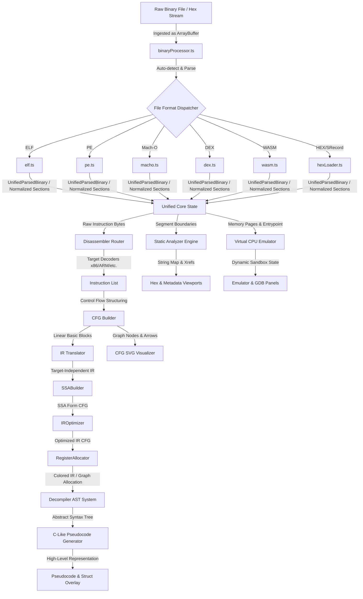
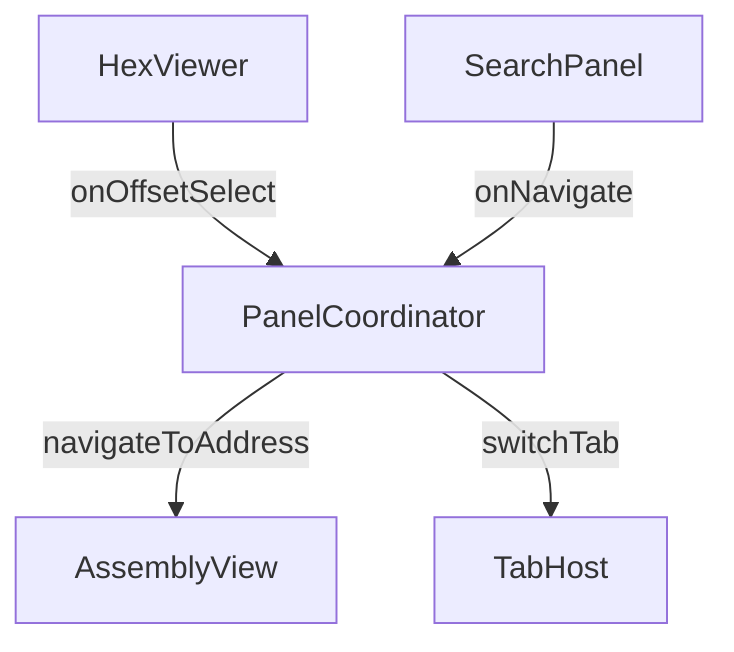

# 🌌 Universal Reverse Engineering Tool (URET) - Complete Developer Specification (DEV.md)

This document provides a comprehensive specification, architectural blueprints, and detailed code walkthroughs of the Universal Reverse Engineering Tool (URET). It is designed to act as the single source of truth for any developer or AI agent working on the URET codebase, eliminating the need to search through files to understand system dependencies and internal logic.

---

## 🏗️ 1. Overall System Architecture & Design

URET is designed as a unidirectional, high-performance static and dynamic analysis pipeline. The primary architectural objective is to translate raw execution artifacts (byte streams, executable formats, raw machine code) into a unified, rich representation suitable for visual analytics, code decompilation, and emulated execution.

### Architectural Flowchart



### Core Design Philosophy
1. **Separation of Concerns:** Low-level file format decoding is isolated in the `src/parser/` module and normalized into schema-conforming objects before reaching disassembly or execution.
2. **Platform-Independent Representation:** Architecture-specific machine instructions are decoded and immediately lifted into a target-independent Intermediate Representation (IR). All optimization passes (such as copy propagation, constant folding, and loop-invariant code motion) execute strictly on this target-independent IR, decoupling analyses from the source Instruction Set Architecture (ISA).
3. **Responsive Visual Frontend:** To prevent thread-blocking during heavy analysis tasks (e.g., parsing large binaries, computing dominance frontiers, or rendering vast call graphs), URET employs asynchronous processing. Visualizations interact with the backend core using specialized coordinators such as [panelCoordinator.ts](file:///home/myname/projects/potato/src/ui/panelCoordinator.ts).
4. **Dynamic Emulation Co-existence:** Static structural data (recovered symbols and section boundaries) directly initializes pages within the virtual [CPU Emulator](file:///home/myname/projects/potato/src/emulator/emulator.ts) memory sandbox, allowing seamless transitions between static graph traversal and step-by-step micro-emulation.

---

## 📂 2. Complete Directory Layout Explanation

The directory structure of URET is logically organized to isolate parsing, disassembling, emulating, static analysis, and UI layers.

```
/potato
├── .agents/                      # AI subagent configurations & instructions
├── docs/                         # Architecture, emulator, and parser documentation
├── fixtures/                     # Test binaries and mock data
├── scratch/                      # Development scripts and temporary artifacts
├── src/                          # Main application source code
│   ├── analyzer/                 # Binary processing, signatures, hashes, and AI bridges
│   ├── disassembler/             # Instruction decoders, CFG, IR, SSA compiler passes
│   ├── emulator/                 # Sandbox virtual CPU, memory pages, and GDB protocols
│   ├── network/                  # Multi-user collaborative syncing state
│   ├── parser/                   # Zero-dependency format loaders (ELF, PE, Mach-O, etc.)
│   ├── public/                   # Static assets for the web application
│   ├── ui/                       # Render panels (Hex, CFG, AST, Emulator, Collaboration)
│   ├── index.html                # Entry point HTML template
│   ├── index.ts                  # Subprocess/server initialization
│   ├── main.ts                   # Core coordinator and UI startup routine
│   ├── mcp-server.ts             # Model Context Protocol server exposing URET tools
│   └── styles.css                # Application styles (dark-mode theme & animations)
└── tests/                        # E2E DOM tests and regression suite
```

### Source Directory Breakdown

| Directory / File | Clickable Link | Description / Responsibilities |
| :--- | :--- | :--- |
| **Ingestion Pipeline** | [src/analyzer/binaryProcessor.ts](file:///home/myname/projects/potato/src/analyzer/binaryProcessor.ts) | Coordinates raw upload ingestion, magic-byte format detection, section mapping, symbol extraction, and initial disassembly routing. |
| **Parser: ELF** | [src/parser/elf.ts](file:///home/myname/projects/potato/src/parser/elf.ts) | Parses Unix/Linux Executable and Linkable Format, resolving section tables, symbols, and dynamic linkage fields. |
| **Parser: PE** | [src/parser/pe.ts](file:///home/myname/projects/potato/src/parser/pe.ts) | Decodes Windows Portable Executable headers, Optional Headers, section data, and walks Import/Export address tables. |
| **Parser: Mach-O** | [src/parser/macho.ts](file:///home/myname/projects/potato/src/parser/macho.ts) | Decodes Darwin/macOS executable command loads, Fat slices, segments, and code signatures. |
| **Parser: DEX** | [src/parser/dex.ts](file:///home/myname/projects/potato/src/parser/dex.ts) | Decodes Android Dalvik Executable files, pools of types, string tables, class metadata, and bytecode instructions. |
| **Parser: WASM** | [src/parser/wasm.ts](file:///home/myname/projects/potato/src/parser/wasm.ts) | Parses WebAssembly binaries utilizing variable-length LEB128 decoders, function types, code signatures, and expression trees. |
| **Hex Loader** | [src/parser/hexLoader.ts](file:///home/myname/projects/potato/src/parser/hexLoader.ts) | Translates raw Intel HEX and Motorola S-Record formats into continuous byte regions. |
| **Disassembly Router** | [src/disassembler/router.ts](file:///home/myname/projects/potato/src/disassembler/router.ts) | Analyzes input buffer headers to identify target ISA and dispatches parsing blocks to target disassemblers. |
| **CFG Builder** | [src/disassembler/cfg.ts](file:///home/myname/projects/potato/src/disassembler/cfg.ts) | Reconstructs Basic Blocks and Control Flow Graph edges from disassembled linear lists of instructions. |
| **Intermediate Rep** | [src/disassembler/ir.ts](file:///home/myname/projects/potato/src/disassembler/ir.ts) | Defines uniform Intermediate Representation micro-ops ([IROp](file:///home/myname/projects/potato/src/disassembler/ir.ts#L14)), operand structures, translation mappings, and the [SSABuilder](file:///home/myname/projects/potato/src/disassembler/ir.ts#L296) compiler pass. |
| **IR Optimizer** | [src/disassembler/optimizer.ts](file:///home/myname/projects/potato/src/disassembler/optimizer.ts) | Runs target-independent optimizations: Constant folding, dead-code elimination, copy propagation, strength reduction, algebraic and phi simplification, liveness analysis, and natural loop hoisting (LICM). |
| **Register Allocator** | [src/disassembler/registerAllocator.ts](file:///home/myname/projects/potato/src/disassembler/registerAllocator.ts) | Uses liveness-based graph-coloring to assign versioned SSA variables to virtual or physical register banks. |
| **Decompiler Core** | [src/disassembler/decompiler.ts](file:///home/myname/projects/potato/src/disassembler/decompiler.ts) | Builds dominator structures, extracts control patterns, parses high-level AST blocks, and emits decompiled C-like pseudocode. |
| **Emulation Sandbox** | [src/emulator/emulator.ts](file:///home/myname/projects/potato/src/emulator/emulator.ts) | Implements the step-by-step CPU instruction emulation state, memory address pages mapping, register mappings, and system call interceptions. |
| **UI Main Layout** | [src/ui/layout.ts](file:///home/myname/projects/potato/src/ui/layout.ts) | Renders the premium IDE container layout, panels drag-resize boundaries, and coordinates sub-elements. |
| **UI CFG Viewer** | [src/ui/cfgVisualizer.ts](file:///home/myname/projects/potato/src/ui/cfgVisualizer.ts) | Generates beautiful interactive SVG renderings of Control Flow Graphs with dynamic branching lines and jump highlights. |
| **MCP Server** | [src/mcp-server.ts](file:///home/myname/projects/potato/src/mcp-server.ts) | Exposes the URET analysis engines as MCP tools, including recursive JSON parameter parsing, 10MB input file size limits, and suffix-matching workspace path resolution. |

---

## 🔁 3. Ingestion & Preprocessing Pipeline

The primary entry point for binary loading is [processBinaryData](file:///home/myname/projects/potato/src/analyzer/binaryProcessor.ts#L35) within [src/analyzer/binaryProcessor.ts](file:///home/myname/projects/potato/src/analyzer/binaryProcessor.ts). When a file is uploaded to the UI or processed via the MCP server, it goes through the following sequence:

### Sequence of Ingestion Steps

```mermaid
sequenceDiagram
    participant User as Client/UI
    participant BP as binaryProcessor.ts
    participant HL as hexLoader.ts
    participant DR as router.ts
    participant Parser as Target Parser (pe/elf/etc.)
    participant CFG as cfg.ts
    participant SA as Static Analyzer

    User->>BP: processBinaryData(fileName, Uint8Array)
    
    rect rgb(20, 20, 35)
        note right of BP: Step 1: Pre-processing & Format Normalization
        BP->>HL: detectFormat(data)
        alt IntelHex or Motorola SRecord
            HL-->>BP: Format Detected
            BP->>HL: parseIntelHex / parseSRecord
            HL-->>BP: Concatenated segments & sections
        else Raw Executable Binary
            HL-->>BP: Not hex loader format
        end
    end

    rect rgb(30, 20, 45)
        note right of BP: Step 2: Auto-detect Target Architecture
        BP->>DR: detectArchitecture(data)
        DR-->>BP: Returns architecture (x86_64, arm, wasm, etc.)
    end

    rect rgb(20, 40, 35)
        note right of BP: Step 3: Format Dispatch & Detail Parsing
        alt Format is ELF
            BP->>Parser: parseElf(arrayBuffer)
        else Format is PE
            BP->>Parser: PEParser.parse()
        else Format is Mach-O
            BP->>Parser: parseMacho(arrayBuffer)
        else Format is DEX
            BP->>Parser: parseDex(arrayBuffer)
        else Format is WASM
            BP->>Parser: parseWasm(arrayBuffer)
        end
        Parser-->>BP: Structured symbols, section RVAs, entrypoints
    end

    rect rgb(40, 30, 20)
        note right of BP: Step 4: Disassembly & Graph Reconstruction
        BP->>DR: disassemble(codeBytes, baseAddress, architecture)
        DR-->>BP: Linear Instructions array
        BP->>CFG: buildCFG(Instructions)
        CFG-->>BP: BasicBlocks (Nodes with edge links)
    end

    rect rgb(20, 30, 40)
        note right of BP: Step 5: Background Analysis
        BP->>SA: Extract strings, calculate section entropy
        BP->>BP: Resolve imports/exports dependencies
    end
    
    BP-->>User: ProcessedBinaryResult
```



### Detailed Pipeline Mechanics
1. **Intel HEX / S-Record Loading:** Before validating file format signatures, [detectFormat](file:///home/myname/projects/potato/src/parser/hexLoader.ts) inspects the byte arrays for ASCII records starting with `:` (Intel HEX) or `S` (Motorola S-Record). If detected, these records are parsed into separate memory chunks and merged into a continuous byte array.
2. **Architecture Detection:** [DisassemblerRouter.detectArchitecture](file:///home/myname/projects/potato/src/disassembler/router.ts) inspects header magic bytes (e.g. `\x7fELF`, `MZ`, `\xfe\xed\xfa\xce`) to establish the executable format. In the case of ELF, it also reads the architecture indicator offset (e.g. machine flags) to resolve whether the underlying ISA is `x86_64`, `arm`, or `arm64`.
3. **Normalizing Metadata:** Every parser output is mapped to common structures, exposing entry points, section boundaries, and symbols.
4. **Disassembly Routing:** Instructions are decoded starting from the entry point and symbol-labeled addresses. The disassembler handles prefixes, operand sizes, and memory reference layouts.
5. **Basic Block Segmentation:** The [buildCFG](file:///home/myname/projects/potato/src/disassembler/cfg.ts) function segments linear instructions. Blocks are split on leaders, and execution paths are linked via successor-predecessor maps.
6. **Workspace Path Resolution & Recursive JSON Ingestion:** When loaded via the [MCP Server](file:///home/myname/projects/potato/src/mcp-server.ts), inputs are normalized dynamically:
   - **Recursive JSON Loading:** The resolver checks if the input is a JSON string. If it contains fields like `filePath` or `data`, it recursively parses and traverses them to load the final payload.
   - **Suffix-Matching Resolution:** If the file path does not exist directly, the parser splits the path and matches suffixes backwards against the workspace root (e.g., matching `src/mcp-server.ts` even if prefixed with an outdated absolute path).
   - **File Size Safeties:** A strict 10MB input file size limit is enforced prior to reading files into session buffers, preventing high-memory pressure.

---

## 🧬 4. File Parsers Structure & Schema

All executable and bytecode parsers implementation under [src/parser/](file:///home/myname/projects/potato/src/parser) output consistent definitions to ensure decoupling.

### Unified Interface Schemas

The target parsers normalize their native representations into the following format schemas:

```typescript
export interface UnifiedParsedBinary {
  format: 'elf' | 'pe' | 'macho' | 'dex' | 'wasm';
  entryPoint: number;
  sections: UnifiedSection[];
  symbols: UnifiedSymbol[];
  metadata: Record<string, any>;
}

export interface UnifiedSection {
  name: string;
  virtualAddress: number;
  size: number;
  data: Uint8Array;
  permissions: {
    read: boolean;
    write: boolean;
    execute: boolean;
  };
}

export interface UnifiedSymbol {
  name: string;
  address: number;
  type: 'function' | 'object' | 'section' | 'unknown';
}
```

### Executable Format Implementations

#### 1. ELF Parser ([src/parser/elf.ts](file:///home/myname/projects/potato/src/parser/elf.ts))
* **Bitness Handling:** Dynamically reads identification bytes (`e_ident[4]`) to parse either 32-bit (Elf32) or 64-bit (Elf64) header offsets.
* **Endianness Support:** Detects big-endian or little-endian modes (`e_ident[5]`) and adjusts helper functions to swap byte alignments accordingly.
* **Symbol Extraction:** Parses the program string tables (`.shstrtab` and `.strtab`) to resolve name strings for section headers, static local variables, and global function entry points.

#### 2. PE Parser ([src/parser/pe.ts](file:///home/myname/projects/potato/src/parser/pe.ts))
* **DOS Stub Extraction:** Matches the `MZ` bytes (0x5A4D) at offset `0x00`, reads the location pointer `e_lfanew` at `0x3C`, and jumps directly to the COFF PE Signature header.
* **Directory Routing:** Walks the directory mapping array in the Optional Header (e.g. Export Directory, Import Directory) to identify standard dynamic linkage libraries (DLLs) and ordinal mappings.
* **PE32 vs PE32+:** Translates memory offset addresses differently based on whether the magic bytes are `0x10b` or `0x20b` to accommodate 64-bit pointers.

#### 3. Mach-O Parser ([src/parser/macho.ts](file:///home/myname/projects/potato/src/parser/macho.ts))
* **Universal Binarics (Fat Executables):** Matches universal header magic values (`0xcafebabe` or `0xbebafeca`). Loops over architecture slices, maps their internal boundaries, and extracts the slice matching the target machine.
* **Load Commands Dispatch:** Sequentially parses variable-length load commands. Routs segment mappings (`LC_SEGMENT` / `LC_SEGMENT_64`), symbol metadata tables (`LC_SYMTAB`), and entry points (`LC_MAIN`).

#### 4. DEX Parser ([src/parser/dex.ts](file:///home/myname/projects/potato/src/parser/dex.ts))
* **Android Bytecode Tables:** Parses the class definitions and methods table.
* **String and Type Pools:** Maps LEB128-encoded lengths to compile structural prototypes and parameter types.
* **CodeItem Extraction:** Locates method execution blocks, mapping register allocations, catch blocks, and JVM bytecode arrays.

#### 5. WASM Parser ([src/parser/wasm.ts](file:///home/myname/projects/potato/src/parser/wasm.ts))
* **Section Scan Loops:** Parses section headers (Type, Function, Import, Code, etc.) using LEB128 varint numbers.
* **Signature Mapping:** Exposes function types (arguments, result counts) to reconstruct the call graphs.

---

## ⚙️ 5. Target-Independent IR & SSA Compiler Passes

Once basic blocks are built, URET's disassembler pipeline lifts target-dependent machine instructions into a target-independent Intermediate Representation (IR), builds Static Single Assignment (SSA) form, runs optimizations, and allocates registers.

### 1. Translation to Target-Independent IR

The translator [IRTranslator](file:///home/myname/projects/potato/src/disassembler/ir.ts#L115) maps target machine opcodes into target-independent operations ([IROp](file:///home/myname/projects/potato/src/disassembler/ir.ts#L14)).

```typescript
export enum IROp {
  ADD = 'ADD', SUB = 'SUB', MUL = 'MUL', DIV = 'DIV',
  AND = 'AND', OR = 'OR', XOR = 'XOR', SHL = 'SHL', SHR = 'SHR',
  LOAD = 'LOAD', STORE = 'STORE', PHI = 'PHI', BRANCH = 'BRANCH',
  MOV = 'MOV', CMP = 'CMP', JMP = 'JMP', RET = 'RET', CALL = 'CALL',
}
```

* **Register Virtualization:** Operands are lifted to uniform [IROperand](file:///home/myname/projects/potato/src/disassembler/ir.ts#L61) definitions. Registers (e.g., `rax`, `rbx`, `r0`) are mapped as variable symbols.
* **Implicit Side Effect Expansion:** Target-specific instruction behavior is expanded into explicit operations. For example, `push rdi` is translated into two IR operations:
  ```
  SUB rsp, rsp, 8
  STORE [rsp], rdi
  ```

### 2. Static Single Assignment (SSA) Form

To enable advanced compiler optimizations, the [SSABuilder](file:///home/myname/projects/potato/src/disassembler/ir.ts#L296) transforms the target-independent IR Control Flow Graph into SSA form.

#### Step 1: Phi Node Insertion
For join nodes in the CFG (basic blocks with more than one predecessor), the builder calculates variables modified along incoming paths. It inserts [PHI](file:///home/myname/projects/potato/src/disassembler/ir.ts#L38) operations at the beginning of the block:
```
var_2 = PHI(var_0, var_1)
```

#### Step 2: Sequential Variable Versioning
The builder traverses instructions in each block.
* Reading a variable sets its version to the active definition version in the current path.
* Writing to a variable increment its version counter, creating a new definition:
  ```
  x_1 = ADD x_0, 1
  ```

#### Step 3: Resolving Phi Arguments
After all block definitions are versioned, the builder traverses join blocks again to map the arguments of each `PHI` instruction to the final version of the corresponding variable in each predecessor block.

---

### 3. Target-Independent Optimization Passes

URET implements a suite of optimization passes in [IROptimizer](file:///home/myname/projects/potato/src/disassembler/optimizer.ts#L6).


#### 1. Constant Folding & SSA Constant Folding
* Evaluates arithmetic operations on constant inputs during compile time.
* If an instruction has immediate arguments (e.g., `ADD 5, 10`), the compiler computes the result (`15`) and simplifies the operation to a `MOV` instruction with the folded constant:
  ```typescript
  // Before
  x_1 = ADD 5, 10
  // After
  x_1 = MOV 15
  ```
* [ssaConstantFolding](file:///home/myname/projects/potato/src/disassembler/optimizer.ts#L598) propagates folded constants through versioned SSA definitions globally.

#### 2. Dead Code Elimination (DCE) & SSA Dead Code Elimination
* Removes instructions that compute values that are never used.
* [ssaDeadCodeElimination](file:///home/myname/projects/potato/src/disassembler/optimizer.ts#L723) walks the SSA usage tree:
  1. Counts the number of times each versioned variable (e.g., `rax_2`) is read.
  2. If an instruction has a destination register and that variable has a read count of 0, the instruction is removed.
  3. Memory writes (`STORE`), function calls (`CALL`), returns (`RET`), and control flow branches are preserved.

#### 3. Copy Propagation
* Propagates copy operations (e.g., `x_2 = MOV y_1`) directly to where the copied variable is used.
* **Visited-Set Cycle Detection / Loop Prevention:** To prevent infinite recursion loops when resolving nested variables or back-edges, the resolver maintains a `visited` set of variable keys:
  ```typescript
  const resolve = (op: IROperand, visited = new Set<string>()): IROperand => {
    if (op.type === 'var' && op.name && op.version !== undefined) {
      const key = `${op.name}_${op.version}`;
      if (visited.has(key)) {
        return op; // Stop traversal to prevent infinite loop
      }
      visited.add(key);
      if (copyMap.has(key)) {
        return resolve(copyMap.get(key)!, visited);
      }
    }
    return op;
  };
  ```

#### 4. Strength Reduction
* Replaces computationally expensive operations with cheaper alternatives.
* Multiplication or division by a power of two is replaced with logical shifts:
  * `MUL x, 8` $\rightarrow$ `SHL x, 3`
  * `DIV x, 4` $\rightarrow$ `SHR x, 2`

#### 5. Algebraic Simplification
* Applies algebraic identities to simplify expressions:
  * Identity addition: `ADD x, 0` $\rightarrow$ `MOV x`
  * Identity subtraction: `SUB x, 0` $\rightarrow$ `MOV x`
  * Zero evaluation: `SUB x, x` $\rightarrow$ `MOV 0`
  * Bitwise identity evaluation: `XOR x, x` $\rightarrow$ `MOV 0`

#### 6. Phi Node Simplification
* Cleans up `PHI` instructions when all incoming values resolve to the same variable:
  ```
  x_3 = PHI(x_1, x_1, x_1)  ===>  x_3 = MOV x_1
  ```

#### 7. Loop Invariant Code Motion (LICM)
* Hoists calculations that do not change inside a loop to a block before the loop.
* **Dominator Analysis:** Computes the set of basic blocks that dominate each block.
* **Natural Loop Identification:** Detects back-edges (e.g., edge $A \rightarrow B$ where $B$ dominates $A$) to define loops.
* **Hoisting Conditionals:** If an instruction's inputs are constants or defined outside the loop, the compiler hoists that instruction to a loop pre-header block.

---

### 4. Register Allocation

After optimizing the IR, the [RegisterAllocator](file:///home/myname/projects/potato/src/disassembler/registerAllocator.ts#L7) maps versioned SSA variables back to physical registers or stack slots.

#### Step 1: Def & Use Sets Identification
For each block, the allocator collects variables defined (`def`) and variables used (`use`) before definition.

#### Step 2: Liveness Analysis
Computes live-in and live-out sets for each block using an iterative data-flow solver:
$$\text{LiveOut}[B] = \bigcup_{S \in \text{Successors}[B]} \text{LiveIn}[S]$$
$$\text{LiveIn}[B] = \text{Use}[B] \cup (\text{LiveOut}[B] \setminus \text{Def}[B])$$

#### Step 3: Interference Graph Construction
The allocator builds a graph where nodes represent variables. An edge is added between two variables if they are live at the same point in the program, meaning they interfere and cannot share the same register.

#### Step 4: Chaitin-Briggs Graph Coloring
1. **Simplify:** Finds a node $V$ with degree less than the number of available registers $K$, removes it from the graph, and pushes it onto a stack.
2. **Spill Decision:** If all nodes have degree $\ge K$, a variable is selected to be spilled to memory (a stack slot).
3. **Select:** Pops nodes off the stack one by one, coloring each node with a register that is not used by its neighbors in the interference graph.

---

## 💻 6. CPU Register Banks & Sub-Register Aliasing

The virtual CPU register layout and translation details are defined in [cpu.ts](file:///home/myname/projects/potato/src/emulator/cpu.ts). 

URET implements x86_64 general-purpose register (GPR) structures with complete support for sub-register aliasing (e.g., reading or writing `eax` or `al` correctly interacts with the underlying `rax` register).

### Architecture of `SUB_REG_MAP`

To track sub-register relationships without implementing custom getters/setters for every alias, URET registers all possible names into a global static registry mapping `SUB_REG_MAP`:

```typescript
interface RegisterInfo {
  gpr: GPR;            // The base 64-bit GPR (e.g., 'rax')
  size: 8 | 16 | 32 | 64; // Size of the alias in bits
  shift: number;       // Bit offset from the LSB (e.g., 'ah' is at bit index 8)
  mask: bigint;        // Bitmask corresponding to the alias size
  zeroExtend: boolean; // Flag indicating if writes zero-extend the base GPR
}
```

This map is populated programmatically for all GPRs (`rax`, `rbx`, etc.) and their sub-registers:
- **32-bit sub-registers (`eax`, `ebx`, etc.)**: Map to base GPRs with size = 32, shift = 0, and `zeroExtend = true` (following x86_64 behavior where 32-bit writes clear the upper 32 bits of the 64-bit register).
- **16-bit sub-registers (`ax`, `bx`, etc.)**: Size = 16, shift = 0, `zeroExtend = false`.
- **8-bit low sub-registers (`al`, `bl`, etc.)**: Size = 8, shift = 0, `zeroExtend = false`.
- **8-bit high sub-registers (`ah`, `bh`, etc.)**: Size = 8, shift = 8, `zeroExtend = false`.
- **R8-R15 sub-registers (`r8d`, `r8w`, `r8b`, etc.)**: Map to base GPRs with appropriate sizes and extensions.

### Reading and Writing Registers

Reads and writes are processed dynamically through the [CPU.read](file:///home/myname/projects/potato/src/emulator/cpu.ts#L170) and [CPU.write](file:///home/myname/projects/potato/src/emulator/cpu.ts#L185) methods:

```typescript
read(name: string): bigint {
  const key = name.toLowerCase();
  const info = SUB_REG_MAP[key];
  if (!info) throw new Error(`Unknown register: ${name}`);

  const val = this.registers[info.gpr];
  return (val >> BigInt(info.shift)) & info.mask;
}
```

```typescript
write(name: string, value: bigint): void {
  const key = name.toLowerCase();
  const info = SUB_REG_MAP[key];
  if (!info) throw new Error(`Unknown register: ${name}`);

  const cleanVal = value & info.mask;

  if (info.size === 64 || (info.zeroExtend && info.size === 32)) {
    // 64-bit write or 32-bit zero-extending write
    this.registers[info.gpr] = cleanVal;
  } else {
    // 16-bit or 8-bit write preserves unaffected bits of the 64-bit register
    const current = this.registers[info.gpr];
    const shift = BigInt(info.shift);
    const preserveMask = ~(info.mask << shift) & 0xffffffffffffffffn;
    this.registers[info.gpr] = (current & preserveMask) | (cleanVal << shift);
  }
}
```

---

## 🧠 7. Page-Aligned Virtual Memory & Page Permission Faults

The page management and virtual mapping layer resides in [memory.ts](file:///home/myname/projects/potato/src/emulator/memory.ts).

### Page Table Structure
Rather than allocating a contiguous array representing the entire 64-bit virtual memory space (which is impossible due to memory constraints), URET implements a sparse page table using virtual page keys:
- **Page Size**: Constant `4096n` bytes.
- **Pages Registry**: `Map<bigint, Uint8Array>` mapping page numbers (`address / 4096n`) to actual 4KB typed buffers.
- **Memory Regions**: A flat array of `MemoryRegion` structures tracking mapped address ranges, names, and permission flags (`read`, `write`, `execute`).

### Access Verification & Fault Injection
Memory access checks are performed before every read or write using [Memory.checkPermission](file:///home/myname/projects/potato/src/emulator/memory.ts#L149):

```typescript
private checkPermission(
  address: bigint,
  accessType: 'read' | 'write' | 'execute'
): void {
  const region = this.getRegionAt(address);
  if (region) {
    if (!region.permissions[accessType]) {
      throw new MemoryAccessError(
        address,
        accessType,
        `Permission denied: ${accessType} access to address 0x${address.toString(16)} in region '${region.name}'`
      );
    }
  } else if (this.strictMode) {
    throw new MemoryAccessError(
      address,
      accessType,
      `Segmentation fault: ${accessType} access to unmapped address 0x${address.toString(16)}`
    );
  }
}
```

### Bypass Phase
During early stage environment creation, the loader must load executable sections (such as `.text`) directly into pages. Because the `.text` segment has its permissions configured as read/execute-only, typical writes would throw permissions errors. The [Memory.write8](file:///home/myname/projects/potato/src/emulator/memory.ts#L210) method provides a `bypassPermissions` flag which bypasses these checks, enabling the binary loader to write code blocks during setup.

---

## 🔌 8. GDB RSP Remote Debugger Protocol Engine

The Remote Serial Protocol (RSP) parser, serial stream wrapper, and debugger execution logic are located in [gdbProtocol.ts](file:///home/myname/projects/potato/src/emulator/gdbProtocol.ts).

### Packet Framing & Checksums
All RSP packets are framed with a starting character `$`, a payload, an ending `#`, and a 2-digit hex checksum:
$$\text{Checksum} = \sum_{c \in \text{Payload}} \text{ASCII}(c) \pmod{256}$$

Special characters (`$`, `#`, `}`, `*`) within the payload are escaped with `}` followed by the character XORed with `0x20`.

### Stream Parser State Machine
To handle fragmented incoming TCP data streams, [GDBProtocolParser](file:///home/myname/projects/potato/src/emulator/gdbProtocol.ts#L183) processes data character-by-character through four states:
1. `idle`: Looking for packet start (`$`), ack (`+`), or nak (`-`).
2. `data`: Reading characters until `#` is reached.
3. `checksum1`: Reading the first hex checksum character.
4. `checksum2`: Reading the second hex checksum character, calculating the checksum, comparing it, and triggering callbacks.

### RSP Command Dispatch
Inside [handleGDBCommand](file:///home/myname/projects/potato/src/emulator/gdbProtocol.ts#L250), URET translates GDB protocol commands into actions on the virtual [Emulator](file:///home/myname/projects/potato/src/emulator/emulator.ts) state:

| Packet Command | Purpose | Expected RSP Response |
|---|---|---|
| `?` | Query halt reason | `S05` (representing stop status SIGTRAP) |
| `g` | Read all registers | Hex stream mapping [X86_64_REGISTERS](file:///home/myname/projects/potato/src/emulator/gdbProtocol.ts#L21) layout in little-endian |
| `G` | Write all registers | `OK` or `E01` |
| `p[idx]` | Read a single register | Hex-encoded value of the register at `idx` |
| `P[idx]=[val]` | Write a single register | `OK` or `E01` |
| `m[addr],[len]` | Read memory | Hex-encoded string of memory contents |
| `M[addr],[len]:[data]` | Write memory | `OK` or `E01` on permission/parsing error |
| `s[addr]` | Single step | `S05` on step success, or `W00` if execution halted |
| `c[addr]` | Continue execution | Steps until hitting a breakpoint, halting, or completing `maxSteps` |
| `qSupported` | Capabilities query | `PacketSize=1024` |

---

## 🎛️ 9. Dashboard Coordination: UI Panel Coordinators

The main UI coordinator logic is contained in [panelCoordinator.ts](file:///home/myname/projects/potato/src/ui/panelCoordinator.ts).

### Central Mediator Pattern
The `PanelCoordinator` coordinates interactions between separate tabs and panels (such as Assembly, Hex, CFG, Yara, and Scripting). Instead of components coupling to each other directly, they call back into the mediator, which delegates state updates and tab switches.



### Lazy Loading and Resource Management
To ensure fast load times, URET implements lazy initialization of heavy analytical views (e.g., dependency graphs, decompiled blocks, control flow graphs):
1. **Critical Path**: `HexViewer`, `AssemblyView`, and `StringsView` load immediately upon binary ingestion.
2. **On-Demand**: When a user selects a tab, [updateActiveTabPanel](file:///home/myname/projects/potato/src/ui/panelCoordinator.ts#L149) checks dirty flags (e.g., `cfgNeedsUpdate`, `yaraNeedsUpdate`). If dirty, the component module is imported dynamically (via dynamic `import` or using [PANEL_REGISTRY](file:///home/myname/projects/potato/src/ui/panelRegistry.ts)) and rendered.
3. **Dirty Flags**: Ingesting a new binary marks all lazy view dirty flags to `true`, clearing outdated cache contexts and forcing updates upon selection.

---

## 🔒 10. Execution Sandbox: Sandboxed Scripting Context

Script parsing and evaluation occurs inside [scripting.ts](file:///home/myname/projects/potato/src/analyzer/scripting.ts).

### Scripting Context API
The engine accepts user-written scripts, exposing a clean API structure for static analysis tasks:

```typescript
export interface ScriptingContext {
  binaryData: Uint8Array;
  entryPoint: number;
  sections: Section[];
  symbols: Symbol[];
  instructions: Instruction[];
  extractedStrings: ExtractedString[];
  dependencies?: { ... };
}
```

### Execution Sandbox Architecture
To run user scripts securely without blocking the primary browser rendering pipeline:
1. **Dynamic Execution**: Compiled using the `new Function` constructor mapping API keys to incoming values.
2. **Output Interception**: Binds a custom console hook replacing standard output endpoints to capture warnings, errors, and standard logs inside a local buffer.
3. **API Helpers**:
   - `getFunctions()`: Retrieves only function-typed symbols.
   - `findSymbol(query)`: Looks up symbols by name or address.
   - `searchInstructions(query)`: Filters assembly text.
   - `readBytes(addr, len)`: Safely translates virtual addresses to physical offsets in `binaryData` to fetch buffers.
   - Wraps standard Node.js APIs (`fs`, `path`) to enable file exports and local caching in environments where script tools run inside automated shells.

---

## 🔍 11. YARA-Like Signature Rules Execution

The YARA pattern matching and rule execution suite is in [yara.ts](file:///home/myname/projects/potato/src/analyzer/yara.ts).

### Rule Compilation & Brace Parsing
The compiler analyzes a ruleset source string by:
1. Stripping comments (`/* ... */` and `// ...`).
2. Scanning for `rule <name> {` declarations.
3. Tracking braces recursively to isolate the block.
4. Tokenizing the block into three properties: `meta`, `strings` (variable patterns), and `condition`.

### Pattern Matching Algorithms
- **Hex Patterns**: Supports wildcards (e.g. `??`). Scans the byte array sequentially, matching patterns at every possible offset.
- **Text Patterns**: Supports `nocase`, `ascii`, and `wide` (UTF-16 LE conversion) modifiers. Ascii maps the target needle to standard UTF-8 arrays, whereas wide pads character bytes to match Windows-style Unicode text.

### Condition Evaluation State Machine
The parser compiles the YARA condition string (such as `$a and not $b` or `any of them`) by replacing variables with their match status:
- Evaluates aggregate matches like `any of them` (uses JS `.some()`) and `all of them` (uses JS `.every()`).
- Translates syntax tokens: `and` $\rightarrow$ `&&`, `or` $\rightarrow$ `||`, `not` $\rightarrow$ `!`.
- Evaluates the boolean equation using a recursive descent parser state machine (`parseExpression` $\rightarrow$ `parseOr` $\rightarrow$ `parseAnd` $\rightarrow$ `parsePrimary`) ensuring brackets and operator precedence are strictly followed.

---

## 🧪 12. Test Setup & Vitest Settings

Build configuration and testing suites are managed via [vite.config.ts](file:///home/myname/projects/potato/vite.config.ts).

### Testing Parameters
- **Test Inclusions**: Resolves testing targets within the root directory and main testing directory:
  ```typescript
  include: ['../tests/**/*.test.ts', '**/*.test.ts']
  ```
- **Test Timeout**: Set to `30000ms` (30 seconds) to ensure that slow-running decompilation passes or long emulator execution loops do not cause test failures under high-load build execution environments.
- **Module Mapping**: Uses `resolve.alias` mapping `@/*` calls back to the active `./src` workspace directory.

---

## 🛠️ 13. WSL Path Permissions Troubleshooting

When running URET disassemblers, compilers, and git runners inside the Windows Subsystem for Linux (WSL), file system mismatches can cause execution blockages (e.g., git commits failing with "Access Denied" or scripts failing to write temporary artifacts).

### Common WSL Permissions Faults and Solutions

#### A. Automount Options (Linux Metadata Mappings)
By default, WSL mounts Windows drives (such as `/mnt/c`) using default Windows users, meaning permissions are mapped as `777` (executable by default) and cannot be modified with Linux commands (`chmod`/`chown`).
* **Symptom**: Private keys fail due to open permissions, or scripts fail when trying to adjust access masks.
* **Resolution**: Force WSL to read Windows permissions as metadata. Edit `/etc/wsl.conf` inside WSL and append:
  ```ini
  [automount]
  enabled = true
  options = "metadata,uid=1000,gid=1000,umask=22,fmask=11"
  ```
  After editing, shut down WSL from a Windows CMD session via `wsl --shutdown` to reload configurations.

#### B. Line Endings (CRLF vs LF)
Editing workspace settings or configurations in Windows and executing them in WSL can lead to execution errors due to differing line endings.
* **Symptom**: Bash scripts fail with `\r: command not found` or configuration parsers error on invisible carriage return characters.
* **Resolution**: Adjust git configuration to write standard Unix line endings when checking out files inside WSL:
  ```bash
  git config --global core.autocrlf input
  ```
  Alternatively, convert files manually using `dos2unix`:
  ```bash
  dos2unix scratch/my_script.sh
  ```

#### C. Path Conversion
Automated scripts passing absolute file paths from Windows editors to WSL terminal runners may cause path resolution errors.
* **Symptom**: `FileNotFound` or permission errors when passing standard paths (e.g., `C:\Users\...`).
* **Resolution**: Use the `wslpath` utility to perform path translations:
  * Translate Windows path to WSL: `wslpath '/home/myname/projects/potato'` $\rightarrow$ `/mnt//home/myname/projects/potato`
  * Translate WSL path to Windows: `wslpath -w '/mnt//home/myname/projects/potato'` $\rightarrow$ `/home/myname/projects/potato`

For more developer environment setups, review [developer_setup.md](file:///home/myname/projects/potato/docs/developer_setup.md).
