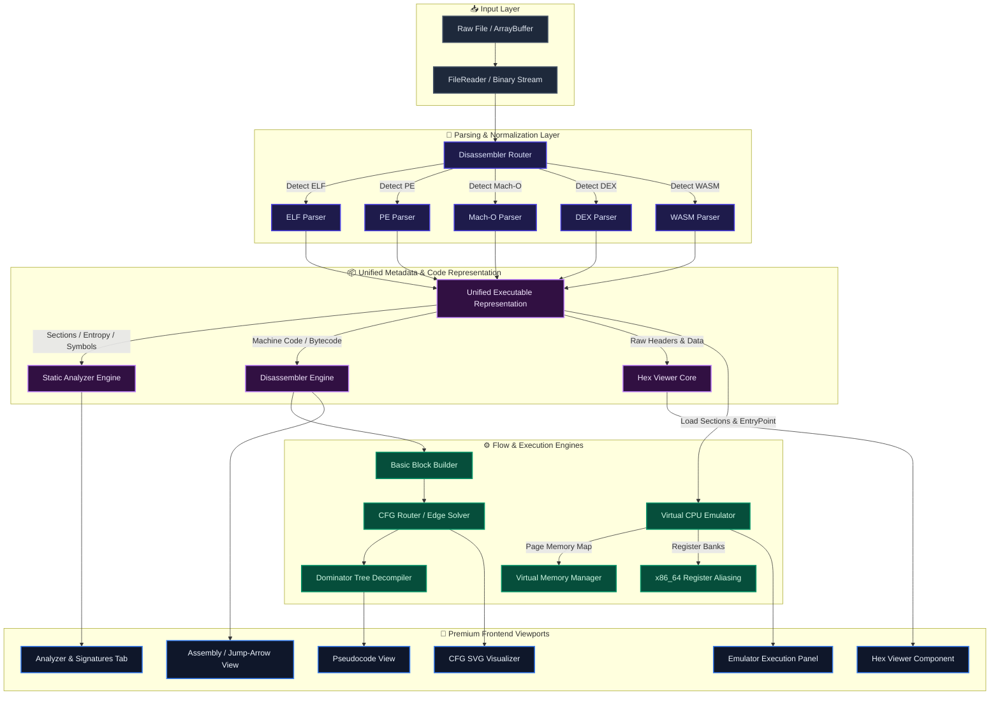

# 🏗️ System Architecture & Data Flow

DISSECT is structured as a unidirectional pipeline that transforms raw binary input (byte streams) into rich, interactive visual representations and an executable virtual emulation state.

---

## 📈 System Architecture Diagram

Below is the high-level architecture of DISSECT showing how files progress from initial upload to UI panels and the virtual emulator.



---

## 🔁 Complete Data Pipeline

### 1. File Ingestion & Auto-Detection

The user uploads a binary file (via drag-and-drop or select file). The coordinator ([main.ts](file:///home/myname/projects/potato/src/main.ts)) reads the data as a `Uint8Array`. The raw array is sent directly to `DisassemblerRouter.detectArchitecture()` which inspects file header magic bytes to resolve the source format:

- **ELF**: `\x7FELF`
- **PE**: `MZ` header (with COFF signature check)
- **Mach-O**: `\xFE\xED\xFA\xCE` or `\xFE\xED\xFA\xCF` (and fat binary headers)
- **DEX**: `dex\n`
- **WASM**: `\x00asm`

### 2. Format Parsing & Section Normalization

Once the format is determined, the corresponding parser (such as [pe.ts](file:///home/myname/projects/potato/src/parser/pe.ts) or [macho.ts](file:///home/myname/projects/potato/src/parser/macho.ts)) executes:

- Reads headers, directories, load commands, or bytecode sections.
- Populates a list of section metadata (virtual addresses, file offsets, raw bytes, read/write/execute permissions).
- Extracts import/export dynamic libraries and names, as well as debugging/linker symbols.

### 3. Disassembly & Flow Analysis

For executable code segments, the `DisassemblerRouter` routes bytes to the corresponding architecture-specific disassembler (e.g. x86_64, ARM, DEX bytecode instructions, or WASM virtual stack instructions).

- Outputs structured `Instruction` records containing operands (registers, immediate values, memory expressions).
- The CFG Builder takes instructions, splits them on branches (`JMP`, `Jcc`, `CALL`, `RET`, etc.), creates basic blocks, and links edges.
- The decompiler builds loop maps and dominator structures to output simplified high-level structure pseudocode.

### 4. Static Analysis Core

Concurrently, the raw executable undergoes static analysis in the background:

- **Entropy Map**: Calculates Shannon entropy per section and reports high-entropy byte regions indicating packers/encryption.
- **Signature Scanner**: Scans byte patterns using compiled Yara-like signatures to locate cryptographic constants, compiler labels, and packaging markers.
- **Strings & Xrefs**: Extracts ASCII/Unicode string patterns and registers cross-references pointing to specific memory offsets.

### 5. Virtual Machine Execution (Emulator)

If execution simulation is requested:

- The parser sections are mapped into the virtual CPU's [Memory](file:///home/myname/projects/potato/src/emulator/memory.ts) pages using configured permissions (R, W, X).
- The registers are initialized, including stack pointer (`rsp`) and program counter (`rip`).
- The emulator executes commands sequentially, translating memory lookups, modifying flag bits (`ZF`, `CF`, `SF`, etc.), and enforcing memory bounds.

---

## ⚡ 6. UI Panel Coordinator & Lazy-Loading Architecture

The frontend of DISSECT is governed by the [PanelCoordinator](file:///home/myname/projects/potato/src/ui/panelCoordinator.ts) class. In order to optimize application startup times, memory consumption, and execution cycles, the user interface features a robust lazy-loading architecture.

### Conceptual Lazy Loading Architecture Diagram

```
[Tab Change Event]
       |
       v
[PanelCoordinator.handleTabChange(tabName)]
       |
       +---------------------------------------------+
       |                                             |
[Is Panel already instantiated?]              [Is Panel class loaded in PANEL_REGISTRY?]
       |                                             |
       +---> Yes: [Update Panel Data]                +---> Yes: [Instantiate & Render]
       |                                             |
       +---> No: [Check Dirty Flag]                  +---> No: [Dynamic ES Import `import(...)`]
                 |                                             |
                 +---> True: Reload data / clear flag          +---> [Fetch script from server]
                 |                                             |
                 +---> False: Serve cached layout              +---> [Register in PANEL_REGISTRY]
                                                               |
                                                               +---> [Instantiate & Render]
```

### Core Design Patterns

The lazy-loading system integrates three core software design patterns:

1. **Decoupled Dynamic Module Loading (ES Imports)**:
   To prevent large visual components (such as [CFGVisualizer](file:///home/myname/projects/potato/src/ui/cfgVisualizer.ts) or [EmulatorPanel](file:///home/myname/projects/potato/src/ui/emulatorPanel.ts)) from bloating the initial JavaScript package size, heavy panels are imported dynamically on-demand using modern ES import syntax.
2. **Global Panel Registry Cache**:
   The registry [PANEL_REGISTRY](file:///home/myname/projects/potato/src/ui/panelRegistry.ts) cache acts as a shared lookup object. Once a dynamic module loads, its class registration is stored globally so subsequent tab switches avoid unnecessary network overhead.
3. **Dirty-State Lifecycle Tracking**:
   Rather than updating all visual panels concurrently whenever a new binary is loaded, the `PanelCoordinator` marks all inactive panels as "dirty" via boolean flags (e.g. `cfgNeedsUpdate = true`). The panels are only refreshed when they are actually viewed.

### Lazy-Loading Lifecycle Mechanics

#### 1. Ingestion and Dirty Marking
When a binary loads, the coordinator runs [onBinaryLoaded()](file:///home/myname/projects/potato/src/ui/panelCoordinator.ts#L112), resetting all panel dirty flags to `true`:
```typescript
this.cfgNeedsUpdate = true;
this.emulatorNeedsUpdate = true;
this.collabNeedsUpdate = true;
// ...
```
Only the primary tabs (Hex Viewer, Assembly View, Strings View) are eagerly initialized.

#### 2. Tab Routing & Active Tab Dispatch
When the user switches tabs, `handleTabChange` is invoked, which subsequently triggers [updateActiveTabPanel()](file:///home/myname/projects/potato/src/ui/panelCoordinator.ts#L149):
- Checks if the current active tab's dirty flag is set to `true`.
- Invokes the corresponding initialization routine (e.g. `initCFGViewer()`, `initEmulatorPanel()`).
- Clears the dirty flag (`this.cfgNeedsUpdate = false`) to prevent future redraw operations.

#### 3. Dynamic Module Instantiation
The coordinator initialization methods determine if the component class has already been fetched:
```typescript
public initCFGViewer() {
  const container = document.getElementById('cfg-viewer-container')!;
  container.innerHTML = '';

  const CFGVisualizerClass = PANEL_REGISTRY['CFGVisualizer'];
  const init = (Clazz: any) => {
    this.cfgVisualizer = new Clazz(container, this.host.state.cfgBlocks, { ... });
  };

  if (CFGVisualizerClass) {
    init(CFGVisualizerClass); // Eager instantiation using cached registry
  } else {
    // Lazy ES Import fetching over network
    import('./cfgVisualizer.js').then((m) => init(m.CFGVisualizer));
  }
}
```

This ensures zero initialization lag on application start, rendering only active panels.
