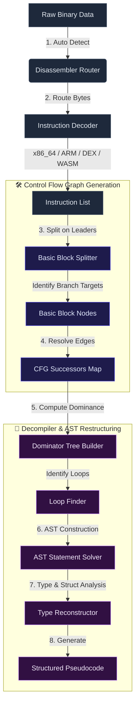
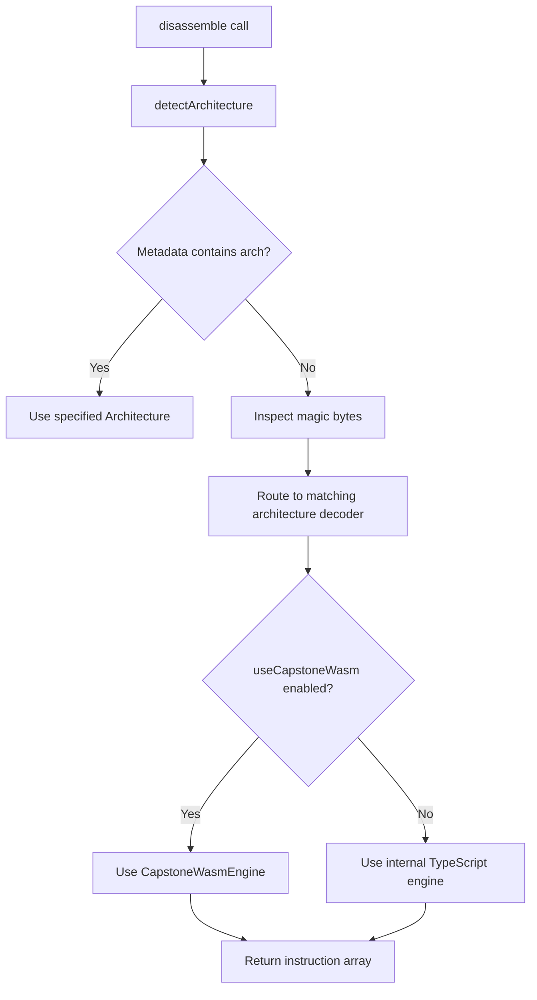

# ⚙️ Disassembler Router & Control Flow Graphs

DISSECT utilizes a multi-stage disassembly and control-flow analysis pipeline. This document explains how raw binaries are translated into structured instructions, routed to specialized disassembly engines, grouped into basic blocks, arranged in a control-flow graph (CFG), and decompiled.

---

## 📈 Disassembly & Decompilation Pipeline



---

## 🔀 1. Disassembler Router & Auto-Detection

The `DisassemblerRouter` ([router.ts](file:///c/Users/NaThA/hacks/sbx/potato/src/disassembler/router.ts)) is the central entry point for byte-to-instruction conversion.

### Auto-Detection Logic

The router automatically detects the binary's target architecture by inspecting the initial byte buffer:
- **DEX**: Identifies Dalvik magic bytes `dex\n` (`64 65 78 0a`).
- **WASM**: Identifies WebAssembly magic bytes `\0asm` (`00 61 73 6d`).
- **NES ROM (MOS 6502)**: Identifies magic bytes `NES\x1a` (`4e 45 53 1a`).
- **ELF**: Reads the ELF magic header (`7f 45 4c 46`) and parses the `e_machine` offset to resolve `x86_64`, `arm` (ARM/AArch64), `riscv`, `mips`/`mipsel`, `ppc`, or `sparc`.
- **PE**: Locates the NT header from `e_lfanew` in the MZ DOS header, reads the machine ID field, and maps it to `x86_64` (`0x8664`) or `arm` (`0xaa64`/`0x01c4`).
- **Mach-O**: Reads magic signatures (`0xfeedface`/`0xfeedfacf`) to identify architecture (CPU types for x86_64 or ARM), handling fat/universal wrappers by slicing individual architectural buffers recursively.

### Router Execution Flow



---

## 🔌 2. Disassembly Engines & Instruction Decoders

DISSECT includes multiple specialized disassembly modules optimized for sequential byte-stream parsing.

### 💻 A. x86_64 Engine ([x86.ts](file:///c/Users/NaThA/hacks/sbx/potato/src/disassembler/x86.ts))

- **Prefix Decoder**: Decodes legacy prefixes (operand size override `0x66`, repeat prefixes `0xf2`/`0xf3`) and 64-bit REX prefixes (`0x40` to `0x4f`), mapping registers to their extended 64-bit counterparts (e.g. `r8`-`r15`, REX.W width control).
- **ModR/M & SIB Parsing**: Inspects the ModR/M byte to determine addressing modes (direct register, register indirect, or displacement). Decodes the Scale-Index-Base (SIB) byte for complex memory offsets (e.g., `[rax + rbx * 4 + 0x10]`).
- **Mnemonic Translation**: Decodes primary opcodes for arithmetic (ADD, SUB, XOR, CMP), control flow (JMP, Jcc, CALL, RET), string ops, and register moves.

### 🛡️ B. ARM / ARM32 / Thumb Engine ([arm.ts](file:///c/Users/NaThA/hacks/sbx/potato/src/disassembler/arm.ts), [arm32.ts](file:///c/Users/NaThA/hacks/sbx/potato/src/disassembler/arm32.ts))

- **AArch64 (ARM 64-bit)**: Processes fixed 32-bit instruction words. Decodes opcodes based on mask configurations to resolve SIMD operations, conditional branches, system registers, loads, stores, and arithmetic.
- **AArch32 (ARM 32-bit)**: Maps standard 32-bit instructions (e.g. data processing, branching with conditions) and parses conditional execution fields.
- **Thumb Mode**: Handles compact 16-bit instructions (and 32-bit Thumb-2 extensions), shifting decoder modes based on program state.

### 🤖 C. Dalvik Engine ([dalvik.ts](file:///c/Users/NaThA/hacks/sbx/potato/src/disassembler/dalvik.ts))

- **Register-Based Stack**: Maps instruction arguments directly to virtual local registers (`v0`-`v255`).
- **Dex Metadata Resolvers**: Resolves type names, method signatures, field names, and string constants using metadata indexes parsed from the DEX file.
- **Opcode Decoder**: Decodes DEX operations like `move`, `const`, `return`, `invoke-virtual`, `invoke-direct`, and branch instructions.

### 🕸️ D. WebAssembly Engine ([wasm.ts](file:///c/Users/NaThA/hacks/sbx/potato/src/disassembler/wasm.ts))

- **WASM bytecode parser**: Directly processes stack-based bytecode instructions.
- **Operand Stack Mapping**: Translates instructions (e.g. `i32.const`, `local.get`, `call`) into typed representations containing arguments and stack height adjustments.
- **Control Flow Nesting**: Maps blocks, loops, and conditions (`block`, `loop`, `if`, `br_if`) to track control flow depths.

### ⚙️ E. Other CPU Architectures

- **RISC-V Engine** ([riscv.ts](file:///c/Users/NaThA/hacks/sbx/potato/src/disassembler/riscv.ts)): Decodes standard RV32/RV64 I, M, A, F, D, and C (Compressed 16-bit) instruction sets.
- **MIPS Engine** ([mips.ts](file:///c/Users/NaThA/hacks/sbx/potato/src/disassembler/mips.ts)): Decodes 32-bit MIPS fixed-width instructions for both Little Endian (mipsel) and Big Endian modes.
- **PowerPC Engine** ([ppc.ts](file:///c/Users/NaThA/hacks/sbx/potato/src/disassembler/ppc.ts)): Handles PowerPC/PowerPC64 instruction words.
- **SPARC Engine** ([sparc.ts](file:///c/Users/NaThA/hacks/sbx/potato/src/disassembler/sparc.ts)): Handles SPARC and SPARC V9 instruction decoding.
- **Z80 & MOS 6502** ([z80.ts](file:///c/Users/NaThA/hacks/sbx/potato/src/disassembler/z80.ts), [m6502.ts](file:///c/Users/NaThA/hacks/sbx/potato/src/disassembler/m6502.ts)): Vintage 8-bit instruction decoders for retro-gaming analysis and legacy microprocessors.
- **CIL / .NET IL Engine** ([dotnetIl.ts](file:///c/Users/NaThA/hacks/sbx/potato/src/disassembler/dotnetIl.ts)): Parses stack-based MSIL bytecode and maps metadata tokens to class and method names.

### 📦 F. Capstone WASM Engine ([capstoneWasm.ts](file:///c/Users/NaThA/hacks/sbx/potato/src/disassembler/capstoneWasm.ts))

Provides an alternative high-performance native-speed disassembly pipeline using a compiled Capstone WASM module.
- Supports `x86_64`, `arm` (ARM64), and `mips`.
- Converts Capstone structural details into unified `Instruction` objects.

---

## 📜 Class & Method API Listings

### Disassembler Router ([router.ts](file:///c/Users/NaThA/hacks/sbx/potato/src/disassembler/router.ts))

```typescript
export type Architecture =
  | 'x86_64'
  | 'arm'
  | 'arm32'
  | 'thumb'
  | 'wasm'
  | 'dex'
  | 'riscv'
  | 'mips'
  | 'mipsel'
  | 'ppc'
  | 'sparc'
  | 'z80'
  | 'm6502'
  | 'cil'
  | 'dotnetIl';

export interface DisassemblyMetadata {
  arch?: Architecture;
  baseAddress?: number;
  entryPoint?: number;
  useCapstoneWasm?: boolean;
  debugInfo?: DexDebugInfo | null;
}

export class DisassemblerRouter {
  constructor(options?: { useCapstoneWasm?: boolean });
  
  public static detectArchitecture(data: Uint8Array, metadata?: DisassemblyMetadata): Architecture;
  
  public disassemble(data: Uint8Array, metadata?: DisassemblyMetadata): Instruction[];
  public setUseCapstoneWasm(value: boolean): void;
  public isUsingCapstoneWasm(): boolean;
}
```

### Capstone WASM Engine ([capstoneWasm.ts](file:///c/Users/NaThA/hacks/sbx/potato/src/disassembler/capstoneWasm.ts))

```typescript
export class CapstoneWasmEngine {
  constructor(arch: string, mode: string);
  
  public load(wasmBytes?: Uint8Array): Promise<boolean>;
  public loadSync(): void;
  public isEngineLoaded(): boolean;
  public disassemble(data: Uint8Array, baseAddress: number): Instruction[];
}
```

### Individual Engines API

Each specialized disassembly file exports a top-level, zero-dependency disassembly function:

- **x86**: `disassembleX86(data: Uint8Array, baseAddress: number): Instruction[]`
- **ARM**: `disassembleArm(data: Uint8Array, baseAddress: number): Instruction[]`
- **ARM32/Thumb**:
  - `disassembleArm32(data: Uint8Array, baseAddress: number): Instruction[]`
  - `disassembleThumb(data: Uint8Array, baseAddress: number): Instruction[]`
- **Dalvik**: `disassembleDalvik(data: Uint8Array, baseAddress: number, debugInfo?: DexDebugInfo | null): Instruction[]`
- **WASM**: `disassembleWasm(data: Uint8Array): Instruction[]`
- **RISC-V**: `disassembleRiscv(data: Uint8Array, baseAddress: number): Instruction[]`
- **MIPS**: `disassembleMips(data: Uint8Array, baseAddress: number, isLittleEndian: boolean): Instruction[]`
- **PowerPC**: `disassemblePpc(data: Uint8Array, baseAddress: number): Instruction[]`
- **SPARC**: `disassembleSparc(data: Uint8Array, baseAddress: number): Instruction[]`
- **Z80**: `disassembleZ80(data: Uint8Array, baseAddress: number): Instruction[]`
- **MOS 6502**: `disassemble6502(data: Uint8Array, baseAddress: number): Instruction[]`
- **CIL / .NET IL**: `disassembleCil(data: Uint8Array, baseAddress: number): Instruction[]`

---

## ⛓️ 3. Control Flow Graph (CFG) Construction

The `CFGBuilder` ([cfg.ts](file:///c/Users/NaThA/hacks/sbx/potato/src/disassembler/cfg.ts)) processes flat arrays of `Instruction` objects to generate basic blocks.

### Basic Block Splitting Algorithm

A **Basic Block** is a sequence of instructions containing a single entry point (the first instruction) and a single exit point (the last instruction). The builder splits instructions using the following **Leaders Rules**:

1. The very first instruction of the function is a leader.
2. Any instruction that is the target of a conditional or unconditional branch is a leader (e.g. jump destination offsets).
3. Any instruction that immediately follows a conditional or unconditional branch instruction is a leader.

### Successor Resolution

After splitting the instructions at leader boundaries into individual blocks, the builder resolves the execution flow edges (**Successors**):

- **Unconditional Jumps (`JMP` / `br`)**: Link to the target block.
- **Conditional Jumps (`Jcc` / `br_if`)**: Link to both the target block and the fall-through block (the next physical block).
- **Call/Return (`CALL` / `RET` / `return-void`)**: Unconditional exit nodes (`RET`) have zero successors. Calls are treated as sequential, branching inside but returning immediately to the fall-through instruction block.

---

## 🧩 4. Decompiler & AST Restructuring

The decompiler ([decompiler.ts](file:///c/Users/NaThA/hacks/sbx/potato/src/disassembler/decompiler.ts)) reconstructs high-level structures from the flat, graph-based representation:

### Dominator Trees

To understand block relationships, the decompiler constructs dominator structures:

- A node $A$ **dominates** a node $B$ ($A \text{ dom } B$) if every path from the entry node to $B$ must pass through $A$.
- **Immediate Dominator (IDom)**: The unique node $A$ that dominates $B$ directly without dominating any other dominators of $B$.
- **Dominance Frontiers**: The set of nodes where dominance ceases. This determines where variables must merge or conditional branch blocks close.

### Loop Detection

The decompiler identifies loops by searching for **Back-Edges** (an edge $A \rightarrow B$ where $B$ dominates $A$).

- $B$ is identified as the loop header.
- The loop body consists of all nodes that can reach $A$ without passing through $B$.
- Loop blocks are restructured into structured `While` or `DoWhile` AST nodes.

### AST Node Translation

The decompiler maps blocks to an Abstract Syntax Tree (AST):

- **Statements**: Translates instruction operands (like `MOV rax, rbx`) into clean assignments (`rax = rbx;`).
- **Conditional Branches (`If` / `Else`)**: Translates block splitting into structured statements:
  ```typescript
  if (condition) {
    // thenBranch
  } else {
    // elseBranch
  }
  ```
- **Type & Struct Inference**: Inspects offset references (e.g. `[rsi + 0x10]`) to reconstruct custom structure layout maps and datatypes. If sequential writes are made to contiguous offsets of a base pointer, they are represented as typed fields of a resolved `struct` type:
  ```typescript
  struct_0.field_16 = rax;
  ```

