# 🧠 Virtual CPU Emulator State & Memory Model

DISSECT integrates a virtual CPU emulator capable of executing compiled instructions step-by-step. The engine is divided into three core parts: CPU register banks, page-aligned virtual memory, and the interpreter execution loop.

---

## 📈 Emulator Model Diagram

Below is the layout of the CPU State, Virtual Memory, and Instruction Execution Pipeline.

```mermaid
graph TD
    %% Register Bank
    subgraph RegisterBank ["💻 CPU Register Banks (cpu.ts)"]
        subgraph GPR ["64-Bit GPRs"]
            RAX["rax / eax / ax / ah / al"]
            RBX["rbx / ebx / bx / bh / bl"]
            RCX["rcx / ecx / cx / ch / cl"]
            RDX["rdx / edx / dx / dh / dl"]
            RSI["rsi / esi / si / sil"]
            RDI["rdi / edi / di / dil"]
            RSP["rsp / esp / sp / spl"]
            RBP["rbp / ebp / bp / bpl"]
            R8["r8 / r8d / r8w / r8b"]
            R15["r15 / r15d / r15w / r15b"]
        end
        RIP["Instruction Pointer: rip"]
        RFLAGS["Flags: rflags ZF / CF / SF / OF / PF / AF / TF / IF / DF"]
    end

    %% Memory Map
    subgraph VirtualMemory ["🧠 Page-Aligned Virtual Memory (memory.ts)"]
        direction TB
        PageTable["Page Directory Map (Page Size: 4096 bytes)"]
        Regions["Mapped Regions Table"]

        Regions -->|Region 1| TEXT[".text - Read/Execute"]
        Regions -->|Region 2| DATA[".data - Read/Write"]
        Regions -->|Region 3| STACK["[stack] - Read/Write"]

        PageTable -->|Lookup physical index| Pages[Allocated Uint8Array chunks]
    end

    %% Interpreter Loop
    subgraph Interpreter ["⚙️ Instruction Interpreter Loop (emulator.ts)"]
        Fetch[1. Fetch Instruction at rip] --> Decode[2. Parse Opcode & Operands]
        Decode --> AddressResolve{Memory Operand?}
        AddressResolve -->|Yes: base + index * scale + disp| MemCheck[3. Verify Memory Permissions]
        MemCheck --> DecodeExec[4. Execute Instruction Logic]
        AddressResolve -->|No| DecodeExec
        DecodeExec --> WriteBack[5. Update Registers / Flags]
        WriteBack --> BreakpointCheck{Breakpoint Hit?}
        BreakpointCheck -->|Yes| Halt[Halt Execution]
        BreakpointCheck -->|No| StepNext[Advance rip / Loop]
    end

    classDef reg fill:#1E293B,stroke:#475569,stroke-width:1px,color:#E2E8F0;
    classDef mem fill:#1e1b4b,stroke:#4f46e5,stroke-width:1px,color:#e0e7ff;
    classDef exec fill:#064E3B,stroke:#059669,stroke-width:1px,color:#D1FAE5;

    class RAX,RBX,RCX,RDX,RSI,RDI,RSP,RBP,R8,R15,RIP,RFLAGS reg;
    class PageTable,Regions,TEXT,DATA,STACK,Pages mem;
    class Fetch,Decode,AddressResolve,MemCheck,DecodeExec,WriteBack,BreakpointCheck,Halt,StepNext exec;
```



---

## 💻 1. CPU Register Banks & Sub-Register Aliasing

The [CPU](file:///c/Users/NaThA/hacks/sbx/potato/src/emulator/cpu.ts#L125) class manages x86_64 general-purpose registers (GPRs) and flag states. In x86_64 architecture, smaller registers map directly to sub-sections of larger 64-bit registers. DISSECT models this structure with precise bit-masking and bit-shifting.

### Sub-Register Aliasing Layout

The 64-bit registers are structured hierarchically:

```
 63                               32 31        16 15     8 7      0
+-----------------------------------+------------+--------+--------+
|                                   |            |   AH   |   AL   |  -> rax / eax / ax
+-----------------------------------+------------+--------+--------+
|                                   |            |   BH   |   BL   |  -> rbx / ebx / bx
+-----------------------------------+------------+--------+--------+
|                                   |            |   CH   |   CL   |  -> rcx / ecx / cx
+-----------------------------------+------------+--------+--------+
|                                   |            |   DH   |   DL   |  -> rdx / edx / dx
+-----------------------------------+------------+--------+--------+
|                                   |            |        |  SIL   |  -> rsi / esi / si
+-----------------------------------+------------+--------+--------+
|                                   |            |        |  DIL   |  -> rdi / edi / di
+-----------------------------------+------------+--------+--------+
|                                   |            |        |  BPL   |  -> rbp / ebp / bp
+-----------------------------------+------------+--------+--------+
|                                   |            |        |  SPL   |  -> rsp / esp / sp
+-----------------------------------+------------+--------+--------+
|                                   |            |        |  r8b   |  -> r8  / r8d / r8w
+-----------------------------------+------------+--------+--------+
|                                   |            |        |  r15b  |  -> r15 / r15d / r15w
+-----------------------------------+------------+--------+--------+
  <------- Zeroed on 32-bit -------> <--- Preserved on 16/8-bit --->
```

### Complete Sub-Register Mapping Table

The following table documents how sub-registers map to their parent 64-bit GPR, along with their offset (shift) and bitmask:

| Sub-Register | Parent GPR | Register Size (Bits) | Bit Range | Offset Shift | Bitmask (`bigint`) | Zero-Extends Parent? |
| :--- | :--- | :--- | :--- | :--- | :--- | :--- |
| **`rax`** | `rax` | 64 | `0..63` | 0 | `0xffffffffffffffffn` | N/A |
| **`eax`** | `rax` | 32 | `0..31` | 0 | `0xffffffffn` | **Yes (Zeros upper 32 bits)** |
| **`ax`** | `rax` | 16 | `0..15` | 0 | `0xffffn` | No (Preserves upper 48 bits) |
| **`al`** | `rax` | 8 | `0..7` | 0 | `0xffn` | No (Preserves upper 56 bits) |
| **`ah`** | `rax` | 8 | `8..15` | 8 | `0xffn` | No (Preserves bits 0-7, 16-63) |
| **`r8`** | `r8` | 64 | `0..63` | 0 | `0xffffffffffffffffn` | N/A |
| **`r8d`** | `r8` | 32 | `0..31` | 0 | `0xffffffffn` | **Yes (Zeros upper 32 bits)** |
| **`r8w`** | `r8` | 16 | `0..15` | 0 | `0xffffn` | No (Preserves upper 48 bits) |
| **`r8b`** | `r8` | 8 | `0..7` | 0 | `0xffn` | No (Preserves upper 56 bits) |

*(Note: The same sub-register layout rules apply to all standard GPRs: `rbx/ebx/bx/bh/bl`, `rcx/ecx/cx/ch/cl`, `rdx/edx/dx/dh/dl`, `rsi/esi/si/sil`, `rdi/edi/di/dil`, `rbp/ebp/bp/bpl`, `rsp/esp/sp/spl`, and GPRs `r8` through `r15` via `rXd` (32-bit), `rXw` (16-bit), and `rXb` (8-bit) suffix naming conventions).*

### Register Write Rules & Bitwise Manipulation Formulas

When writing to a register, the [CPU.write()](file:///c/Users/NaThA/hacks/sbx/potato/src/emulator/cpu.ts#L185) method processes writes using these rules:

1. **64-bit Writes**:
   The value is masked to 64 bits and directly written to the register slot.
   $$\text{Reg}[\text{parent}] = \text{value} \ \& \ \text{0xFFFFFFFFFFFFFFFFN}$$

2. **32-bit Writes (Zero-Extension Rule)**:
   In x86_64, any write to a 32-bit register (such as `eax` or `r8d`) automatically clears the upper 32 bits of the parent register.
   $$\text{Reg}[\text{parent}] = \text{value} \ \& \ \text{0xFFFFFFFFN}$$
   *(Note: The `zeroExtend` flag is set to `true` for 32-bit sub-registers in [SUB_REG_MAP](file:///c/Users/NaThA/hacks/sbx/potato/src/emulator/cpu.ts#L51)).*

3. **16-bit and 8-bit Writes (Preservation Rule)**:
   Writing to a 16-bit register (e.g. `ax`), an 8-bit low register (e.g. `al`), or an 8-bit high register (e.g. `ah`) preserves all other bits of the 64-bit parent register.
   $$\text{mask}_{\text{preserve}} = \sim(\text{mask}_{\text{sub}} \ll \text{shift}) \ \& \ \text{0xFFFFFFFFFFFFFFFFN}$$
   $$\text{Reg}[\text{parent}] = (\text{Reg}[\text{parent}] \ \& \ \text{mask}_{\text{preserve}}) \ | \ ((\text{value} \ \& \ \text{mask}_{\text{sub}}) \ll \text{shift})$$
   *Example: Writing `0x12` to `ah` when `rax` is `0xDEADC0DE0000FFFFn`:*
   - `shift` is `8`, `mask` is `0xFFn`.
   - `preserveMask` is `~0xFF00n & 0xffffffffffffffffn` which evaluates to `0xFFFFFFFFFFFF00FFn`.
   - `rax` becomes `(0xDEADC0DE0000FFFFn & 0xFFFFFFFFFFFF00FFn) | (0x12n << 8n)` $\rightarrow$ `0xDEADC0DE000012FFn`.

### The `rflags` Status Flags

The [RFlag](file:///c/Users/NaThA/hacks/sbx/potato/src/emulator/cpu.ts#L30) enum maps specific bits within the 64-bit `rflags` register:

| Flag Name | Enum Constant | Bit Position | Description |
| :--- | :--- | :--- | :--- |
| **Carry Flag (CF)** | `CF = 1 << 0` | Bit 0 | Set if an arithmetic operation generated a carry out of the most significant bit. |
| **Parity Flag (PF)** | `PF = 1 << 2` | Bit 2 | Set if the least significant byte of the result contains an even number of 1 bits. |
| **Auxiliary Carry Flag (AF)** | `AF = 1 << 4` | Bit 4 | Used in binary-coded decimal (BCD) arithmetic operations. |
| **Zero Flag (ZF)** | `ZF = 1 << 6` | Bit 6 | Set if the result of the last operation was zero. |
| **Sign Flag (SF)** | `SF = 1 << 7` | Bit 7 | Set if the result of the last operation was negative (MSB is 1). |
| **Trap Flag (TF)** | `TF = 1 << 8` | Bit 8 | Set to enable single-step debugging mode. |
| **Interrupt Enable Flag (IF)** | `IF = 1 << 9` | Bit 9 | Controls response to external interrupts. |
| **Direction Flag (DF)** | `DF = 1 << 10` | Bit 10 | Determines string operations direction (0 = increment, 1 = decrement). |
| **Overflow Flag (OF)** | `OF = 1 << 11` | Bit 11 | Set if signed integer overflow occurred. |

The flags are retrieved and modified using helper methods:
- [CPU.getFlag(flag)](file:///c/Users/NaThA/hacks/sbx/potato/src/emulator/cpu.ts#L225): Retrieves if a specific flag is set via bitwise AND `(rflags & flag) !== 0`.
- [CPU.setFlag(flag, value)](file:///c/Users/NaThA/hacks/sbx/potato/src/emulator/cpu.ts#L233): Sets or clears a flag using bitwise OR/AND operations.

---

## 🧠 2. Page-Aligned Virtual Memory Model

The [Memory](file:///c/Users/NaThA/hacks/sbx/potato/src/emulator/memory.ts#L25) class implements page-based address translation and permission enforcement. Rather than allocating a single monolithic array, it splits virtual memory space into discrete pages.

### Page Directory Map and Translation

```
Virtual Address (64-Bit)
+------------------------------------------------------+-----------------------+
|              Page Directory Key (52 bits)            |  Page Offset (12 bits)|
+------------------------------------------------------+-----------------------+
                           |                                       |
                           v                                       |
                Map Lookup in `this.pages`                         |
          [Page Key] -> Uint8Array (4096 Bytes)                    |
                           |                                       |
                           v                                       v
                     +-----------+                            +----------+
                     | Byte Data | -------------------------> |  Offset  |
                     +-----------+                            +----------+
```

1. **Page Size ($2^{12} = 4096$ bytes)**:
   The page boundaries are aligned on 4096-byte blocks.
2. **Page Directory Lookup**:
   The memory model keeps allocated pages inside a TypeScript `Map<bigint, Uint8Array>`.
3. **Address Translation Formulas**:
   When access is requested at virtual address `addr`:
   - **Page Key**: Calculated as integer division:
     $$\text{Page Key} = \text{addr} \ / \ 4096\text{n} \quad (\text{or } \text{addr} \gg 12\text{n})$$
   - **Page Offset**: Calculated as remainder:
     $$\text{Offset} = \text{Number}(\text{addr} \ \% \ 4096\text{n}) \quad (\text{or } \text{Number}(\text{addr} \ \& \ 0\text{xFFF}\text{n}))$$
4. **Lazy Allocation**:
   Pages are not pre-allocated unless mapped explicitly. The `ensurePage(pageKey)` helper allocates a new `Uint8Array(4096)` only when a write operation target is initialized.

### Memory Regions & Permissions Enforcement

The emulator maintains a table of [MemoryRegion](file:///c/Users/NaThA/hacks/sbx/potato/src/emulator/memory.ts#L3) metadata objects. Each region defines:
- **`address`**: The virtual base address.
- **`size`**: The total byte size.
- **`name`**: The region/segment name (e.g., `.text`, `.data`, `[stack]`).
- **`permissions`**: An object detailing `read`, `write`, and `execute` capability flags.

#### Access Control Flow & Strict Mode

Whenever a read, write, or fetch is issued, the [Memory.checkPermission(address, accessType)](file:///c/Users/NaThA/hacks/sbx/potato/src/emulator/memory.ts#L149) method validates the request:
1. It calls `getRegionAt(address)` to find the mapped region enclosing the address.
2. If a region is found:
   - It checks the region's permission flags for the requested `accessType` (`read`, `write`, or `execute`).
   - If the flag is `false`, it throws a [MemoryAccessError](file:///c/Users/NaThA/hacks/sbx/potato/src/emulator/memory.ts#L14).
3. If no region is found containing the address:
   - If `strictMode` is set to `true`, it immediately throws a [MemoryAccessError](file:///c/Users/NaThA/hacks/sbx/potato/src/emulator/memory.ts#L14) (simulating a standard Unix **Segmentation Fault**).
   - If `strictMode` is `false`, the operation is permitted (useful during relaxed analysis).

### Little-Endian Endianness

All multibyte read/write operations perform bitwise encoding/decoding as Little-Endian:

- **16-bit word**:
  - `read16(addr)`: $\text{val}_0 \ | \ (\text{val}_1 \ll 8)$
  - `write16(addr, val)`: Write `val & 0xFF` to `addr`, write `(val >> 8) & 0xFF` to `addr + 1`.
- **32-bit double-word**:
  - `read32(addr)`: $\text{val}_0 \ | \ (\text{val}_1 \ll 8) \ | \ (\text{val}_2 \ll 16) \ | \ (\text{val}_3 \ll 24)$
  - `write32(addr, val)`: Byte-by-byte shifting and masking over 4 consecutive bytes.
- **64-bit quad-word**:
  - `read64(addr)`: Combines two 32-bit reads (low and high) as bigints:
    $$\text{read64}(addr) = (\text{read32}(addr + 4\text{n}) \ll 32\text{n}) \ | \ \text{read32}(addr)$$
  - `write64(addr, val)`: Splits the 64-bit bigint into two 32-bit writes.

---

## ⚙️ 3. Instruction Interpreter & Execution Loop

The [Emulator](file:///c/Users/NaThA/hacks/sbx/potato/src/emulator/emulator.ts) class runs the core fetch-decode-execute instruction interpreter cycle.

### Operand Address Resolution

For instruction memory operands (such as `[rax + rdi * 8 + 0x10]`), the emulator resolves virtual addresses dynamically using the standard x86_64 addressing formula:

$$\text{Resolved Address} = \text{Base} + (\text{Index} \times \text{Scale}) + \text{Displacement}$$

Where:
- **`Base`**: The 64-bit value of the specified base register (or `0` if none).
- **`Index`**: The 64-bit value of the index register (or `0` if none).
- **`Scale`**: An integer multiplier (typically 1, 2, 4, or 8).
- **`Displacement`**: An immediate sign-extended numerical offset.

### Supported Operations & Flag Modifications

The loop interprets the instructions and manages flag states:
- **`MOV` / `LEA`**: Copies registers/memory or calculates effective addresses.
- **`ADD` / `SUB` / `CMP`**: Performs arithmetic and updates flags:
  - **`ZF` (Zero Flag)**: Set if the result is `0`.
  - **`SF` (Sign Flag)**: Set if the result's MSB is `1` (negative).
  - **`CF` (Carry Flag)**: Set if unsigned overflow occurs.
  - **`OF` (Overflow Flag)**: Set if signed overflow occurs.
- **`PUSH` / `POP`**: Adjusts the `rsp` stack pointer and writes/reads values from mapped stack pages.
- **`CALL` / `RET`**: Controls subroutine branch linkages by saving return pointers to the stack.
- **`Jcc`**: Executes conditional branching depending on flag bit states (e.g. `JE` checks if `ZF = 1`, `JNE` checks if `ZF = 0`).

### Breakpoints and Execution Controls

- **`step()`**: Executes a single decoded instruction at `rip`, updates the instruction pointer, and halts on memory permissions or debugger limits.
- **`run()`**: Loops execution continuously. Stops if `rip` hits a registered breakpoint address, if execution cycles exceed a max threshold, or if a halt exception is thrown.
