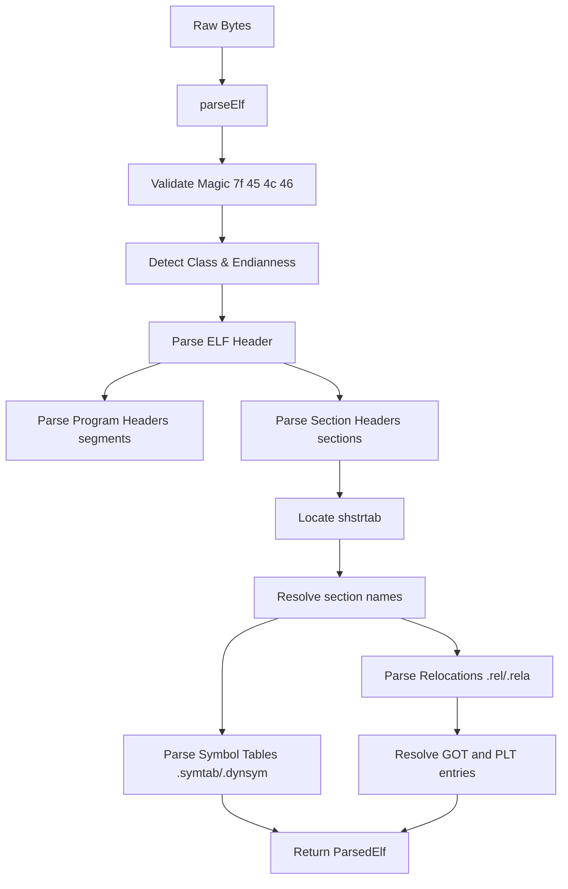
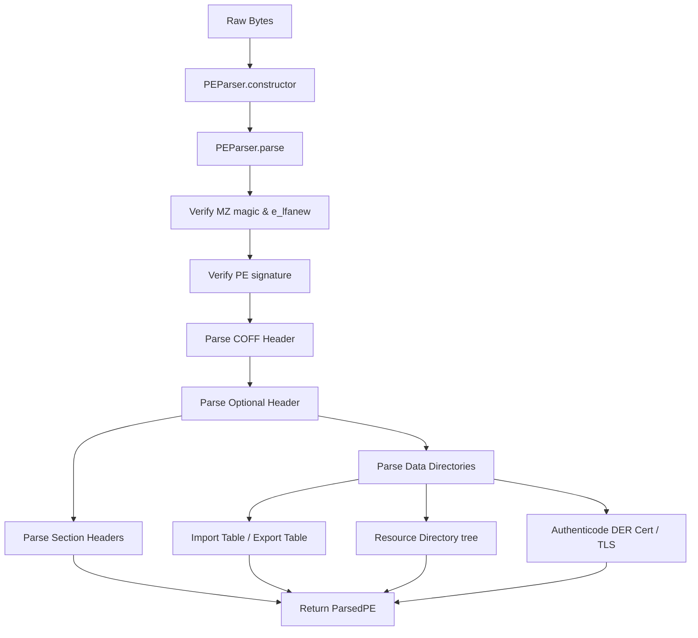
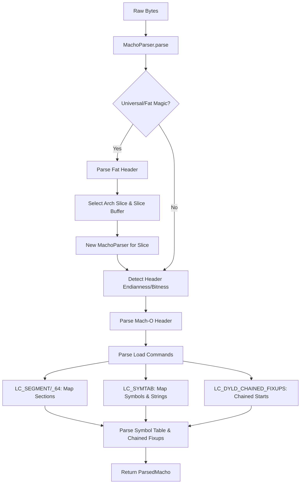
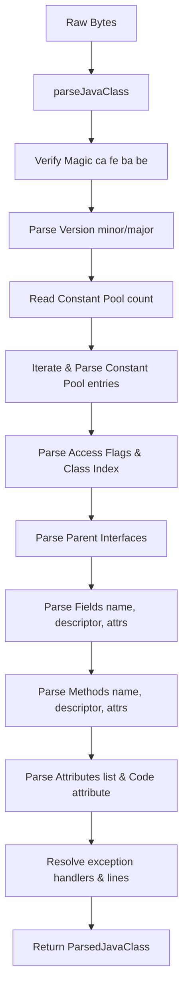

# 🧬 Binary Parsers (ELF, PE, Mach-O, Java, DEX, WASM)

DISSECT implements zero-dependency, robust parsers for major executable formats and bytecode formats. Each parser reads a binary `Uint8Array` buffer sequentially using helper readers to reconstruct native headers, metadata structures, tables, and bytecode arrays.

---

## 🛠️ Parser List & File Locations

| Format | Module File | Description | Magic Numbers |
| :--- | :--- | :--- | :--- |
| **ELF** | [elf.ts](file:///c/Users/NaThA/hacks/sbx/potato/src/parser/elf.ts) | Executable and Linkable Format (Linux/BSD/Unix) | `7f 45 4c 46` (`\x7fELF`) |
| **PE** | [pe.ts](file:///c/Users/NaThA/hacks/sbx/potato/src/parser/pe.ts) | Portable Executable (Windows PE32/PE32+) | `4d 5a` (`MZ` header) |
| **Mach-O** | [macho.ts](file:///c/Users/NaThA/hacks/sbx/potato/src/parser/macho.ts) | Mach Object (macOS/iOS/Darwin Executable) | `fe ed fa ce`, `fe ed fa cf` |
| **Java Class** | [javaClass.ts](file:///c/Users/NaThA/hacks/sbx/potato/src/parser/javaClass.ts) | Java Virtual Machine Class File Format | `ca fe ba be` |
| **DEX** | [dex.ts](file:///c/Users/NaThA/hacks/sbx/potato/src/parser/dex.ts) | Dalvik Executable (Android bytecode) | `64 65 78 0a` (`dex\n`) |
| **WASM** | [wasm.ts](file:///c/Users/NaThA/hacks/sbx/potato/src/parser/wasm.ts) | WebAssembly Binary Module | `00 61 73 6d` (`\x00asm`) |

### Specialized & Helper Parsers

- **COFF Header Parser**: [coff.ts](file:///c/Users/NaThA/hacks/sbx/potato/src/parser/coff.ts) parses standalone Common Object File Format (COFF) objects.
- **DWARF Debug Symbols**: [dwarfParser.ts](file:///c/Users/NaThA/hacks/sbx/potato/src/parser/dwarfParser.ts) decodes DWARF v2-v5 debug tables.
- **.NET Metadata**: [dotnetMetadata.ts](file:///c/Users/NaThA/hacks/sbx/potato/src/parser/dotnetMetadata.ts) parses CLI headers, metadata tables, and streams.
- **Mach-O Objective-C Metadata**: [machoObjc.ts](file:///c/Users/NaThA/hacks/sbx/potato/src/parser/machoObjc.ts) extracts classes, methods, and protocols.
- **Mach-O Code Signature**: [machoSignature.ts](file:///c/Users/NaThA/hacks/sbx/potato/src/parser/machoSignature.ts) extracts and parses signature blobs.
- **Static Archive Reader**: [archive.ts](file:///c/Users/NaThA/hacks/sbx/potato/src/parser/archive.ts) parses UNIX ar formats (e.g. `.a` static libraries).
- **Intel Hex Loader**: [hexLoader.ts](file:///c/Users/NaThA/hacks/sbx/potato/src/parser/hexLoader.ts) parses standard hex dumps into byte arrays.

---

## 🔍 Detailed Parsing Mechanisms

### 🐧 1. ELF (Executable and Linkable Format)

The ELF parser supports both 32-bit and 64-bit offsets, as well as Little Endian and Big Endian byte layouts.

- **Header Decoding**: Parses the `e_ident` array to identify bitness (`class`), byte order (`endianness`), OS ABI, file type (REL, EXEC, DYN, CORE), and target machine architecture (x86, ARM, AMD64, RISC-V, MIPS, PowerPC, SPARC).
- **Program Headers**: Loops through program headers (segments) representing runtime memory layouts. Decodes flags to resolve R, W, and X permissions.
- **Section Headers**: Identifies static layout structure. When string tables (`shstrtab`, `strtab`, `dynstr`) are parsed, offsets are resolved to represent section names (e.g., `.text`, `.data`, `.rodata`, `.bss`, `.symtab`).
- **Symbol Table**: Walks `.symtab` and `.dynsym` entries to extract local and global labels.
- **Relocations**: Parses `.rel` and `.rela` sections to resolve dynamic relocation offsets and target symbol indices.
- **GOT and PLT**: Maps Global Offset Table (`.got`) and Procedure Linkage Table (`.plt`) addresses to import symbols.

### 🪟 2. PE (Portable Executable)

Designed to handle both PE32 (32-bit) and PE32+ (64-bit) architectures.

- **DOS Stub**: Locates the `MZ` signature and extracts the `e_lfanew` pointer at offset `0x3C`, which points to the starting location of the NT headers.
- **COFF File Header**: Decodes characteristics, timestamp, number of sections, and machine type (e.g., AMD64, I386, ARM64, ARMNT).
- **Optional Header**: Decodes memory layout settings, including the entrypoint relative virtual address (RVA), section alignment (commonly `0x1000`), file alignment (commonly `0x200`), image base, and size of image.
- **Data Directories**: Parses up to 16 directory structures pointing to import tables, export tables, resources, and exception records.
- **Imports & Exports**: Walks the import address table (IAT) and import lookup table (ILT) resolving DLL names and imported functions. Decodes the export table to catalog public symbols, ordinals, and forwarders.
- **Resources**: Recursively parses the Resource Directory tree (Type, Name, and Language directories) to extract binary blobs, icons, strings, and XML manifests.
- **TLS**: Identifies Thread Local Storage directories and callbacks.
- **Authenticode**: Parses the digital signature block using an ASN.1 DER decoder to extract certificates and verify image hash values against expected values.

### 🍎 3. Mach-O (macOS & iOS Executables)

Capable of processing 32-bit, 64-bit, and Fat/Universal binary wraps.

- **Universal Header**: Detects universal wrappers (`0xcafebabe` or `0xbebafeca`). Iterates over target slices (fat architectures) to automatically select and extract the slice corresponding to the target architecture.
- **Load Commands**: Iterates through variable-length commands following the main Mach-O header.
  - `LC_SEGMENT` / `LC_SEGMENT_64`: Maps segments (such as `__TEXT`, `__DATA`, `__LINKEDIT`) and sections (`__text`, `__cstring`, `__const`).
  - `LC_SYMTAB`: Provides offsets for symbol tables and string pools.
  - `LC_MAIN`: Contains the offset representing the program's main entrypoint.
  - `LC_LOAD_DYLIB`: Identifies referenced shared libraries (dylibs).
  - `LC_DYLD_CHAINED_FIXUPS`: Resolves chained binding fixups (page starts, imports, and symbols).
- **Chained Fixups**: Walks the chained starts structure in segmented pages, reading bind and rebase offsets, resolving symbols, and linking them to import names.

### ☕ 4. Java Class (JVM Class Format)

Parses standard Java compiler output files (.class) representing JVM bytecode.

- **Constant Pool**: Reads 1-indexed constant entries representing Utf8 strings, class names, method/field references, integers, longs, floats, doubles, and string indices. Long and Double entries consume two consecutive pool slots.
- **Access Flags**: Decodes flags for classes, fields, and methods (e.g., `public`, `private`, `static`, `final`, `synchronized`, `bridge`, `varargs`).
- **Interfaces**: Reads references to parent interfaces implemented by the class.
- **Fields & Methods**: Walks the field and method lists, resolving name and descriptor indices from the Constant Pool.
- **Code Attributes**: Identifies and parses the `'Code'` attribute containing the raw JVM bytecode array, maximum stack size, local variable count, and Exception Handler Table.
- **Secondary Attributes**: Resolves Line Number tables (`LineNumberTable`), Local Variable Tables, Source File links (`SourceFile`), and Inner Classes.

### 🤖 5. DEX (Dalvik Executable)

Decodes Android bytecode files.

- **Header Mapping**: Validates DEX version (`dex\n035\0` or `dex\n039\0`). Collects size boundaries and table offsets for String IDs, Type IDs, Proto IDs, Field IDs, Method IDs, Class Definitions, and the overall Data section.
- **String & Type Resolvers**: Parses the string pool using LEB128 lengths and decodes Type descriptors (e.g. `Ljava/lang/String;`).
- **Prototypes & Methods**: Resolves method signatures (parameters, return types) and associations.
- **Class Definitions**: Iterates over class fields and methods. Extracts `CodeItem` records containing instruction counts, registers used, catch handler tables, and raw bytecode offsets.

### 🕸️ 6. WASM (WebAssembly)

Parses structured WebAssembly binaries conforming to the W3C WASM specs.

- **Leb128 Decoding**: Implements varint parsing to read unsigned/signed 32-bit and 64-bit variables.
- **Section Scanner**: Loops through standard section IDs (Type, Import, Function, Table, Memory, Global, Export, Start, Element, Code, Data).
- **Type & Function Signatures**: Decodes parameter and result types (i32, i64, f32, f64, v128, reference types) into structured objects.
- **Code Section Parser**: Inspects raw bytecode instruction streams within function blocks. Decodes WASM control instructions (`block`, `loop`, `if`, `br`, `br_table`), variable instructions (`local.get`, `global.set`), and numeric operations (`i32.add`, `f64.mul`).

---

## 🔄 Execution Flows

### 1. ELF Parser Flow


### 2. PE Parser Flow


### 3. Mach-O Parser Flow


### 4. Java Class Parser Flow


---

## 📜 Class & Method API Listings

### ELF Parser ([elf.ts](file:///c/Users/NaThA/hacks/sbx/potato/src/parser/elf.ts))

#### Functions
- `parseElf(arrayBuffer: ArrayBuffer): ParsedElf`
  Main entry point for parsing ELF binaries.

#### Interfaces
```typescript
export interface ElfHeader {
  class: '32-bit' | '64-bit' | 'Unknown';
  endianness: 'Little Endian' | 'Big Endian' | 'Unknown';
  osAbi: string;
  type: string;
  machine: string;
  entryPoint: bigint | number;
  phOff: bigint | number;
  shOff: bigint | number;
  flags: number;
  ehSize: number;
  phentSize: number;
  phNum: number;
  shentSize: number;
  shNum: number;
  shStrNdX: number;
}

export interface ElfSectionHeader {
  nameOffset: number;
  name: string;
  type: number;
  typeName: string;
  flags: bigint | number;
  addr: bigint | number;
  offset: bigint | number;
  size: bigint | number;
  link: number;
  info: number;
  addralign: bigint | number;
  entsize: bigint | number;
}

export interface ElfProgramHeader {
  type: number;
  typeName: string;
  flags: number;
  offset: bigint | number;
  vaddr: bigint | number;
  paddr: bigint | number;
  filesz: bigint | number;
  memsz: bigint | number;
  align: bigint | number;
}

export interface ElfSymbol {
  name: string;
  nameOffset: number;
  value: bigint | number;
  size: bigint | number;
  info: number;
  other: number;
  shndx: number;
  bind: string;
  type: string;
}

export interface ElfRelocation {
  offset: bigint | number;
  info: bigint | number;
  addend?: bigint | number;
  symbolIndex: number;
  symbolName: string;
  type: number;
  typeName: string;
}

export interface ParsedElf {
  header: ElfHeader;
  programHeaders: ElfProgramHeader[];
  sectionHeaders: ElfSectionHeader[];
  symbols: ElfSymbol[];
  relocations: ElfRelocation[];
  gotEntries: GotEntry[];
  pltEntries: PltEntry[];
}
```

### PE Parser ([pe.ts](file:///c/Users/NaThA/hacks/sbx/potato/src/parser/pe.ts))

#### Classes
- `PEParser`
  - `constructor(buffer: ArrayBuffer)`: Initializes data view and byte reader.
  - `parse(): ParsedPE`: Decodes headers, section tables, data directories, imports, exports, resources, TLS, and Authenticode.

#### Interfaces
```typescript
export interface DosHeader {
  magic: string; // "MZ"
  e_lfanew: number; // Offset to PE signature
}

export interface CoffHeader {
  machine: number;
  numberOfSections: number;
  timeDateStamp: number;
  pointerToSymbolTable: number;
  numberOfSymbols: number;
  sizeOfOptionalHeader: number;
  characteristics: number;
}

export interface OptionalHeader {
  magic: number; // 0x10b (PE32), 0x20b (PE32+)
  majorLinkerVersion: number;
  minorLinkerVersion: number;
  sizeOfCode: number;
  sizeOfInitializedData: number;
  sizeOfUninitializedData: number;
  addressOfEntryPoint: number;
  baseOfCode: number;
  baseOfData?: number; // PE32 only
  imageBase: bigint | number;
  sectionAlignment: number;
  fileAlignment: number;
  majorOperatingSystemVersion: number;
  minorOperatingSystemVersion: number;
  majorImageVersion: number;
  minorImageVersion: number;
  majorSubsystemVersion: number;
  minorSubsystemVersion: number;
  win32VersionValue: number;
  sizeOfImage: number;
  sizeOfHeaders: number;
  checkSum: number;
  subsystem: number;
  dllCharacteristics: number;
  sizeOfStackReserve: bigint | number;
  sizeOfStackCommit: bigint | number;
  sizeOfHeapReserve: bigint | number;
  sizeOfHeapCommit: bigint | number;
  loaderFlags: number;
  numberOfRvaAndSizes: number;
  dataDirectories: DataDirectory[];
}

export interface ExportTable {
  dllName: string;
  characteristics: number;
  timeDateStamp: number;
  majorVersion: number;
  minorVersion: number;
  ordinalBase: number;
  exports: ExportEntry[];
}

export interface ImportTable {
  dllName: string;
  imports: ImportEntry[];
  importAddressTableRva?: number;
  importLookupTableRva?: number;
}

export interface AuthenticodeInfo {
  isValid: boolean;
  error?: string;
  hashAlgorithm?: string;
  expectedHash?: string;
  actualHash?: string;
  certificates: AuthenticodeCertificate[];
}

export interface ParsedPE {
  is32Bit: boolean;
  dosHeader: DosHeader;
  coffHeader: CoffHeader;
  optionalHeader: OptionalHeader;
  sections: SectionHeader[];
  imports: ImportTable[];
  exports?: ExportTable;
  resources?: {
    manifests: string[];
    strings: Record<number, string>;
    icons: { type: number | string; size: number; offset: number }[];
    all: ParsedResource[];
  };
  tls?: ParsedTLS;
  authenticode?: AuthenticodeInfo;
}
```

### Mach-O Parser ([macho.ts](file:///c/Users/NaThA/hacks/sbx/potato/src/parser/macho.ts))

#### Classes
- `MachoParser`
  - `constructor(buffer: ArrayBuffer | Uint8Array)`
  - `parse(options?: MachoParserOptions): ParsedMacho`

#### Functions
- `parseMacho(buffer: ArrayBuffer | Uint8Array, options?: MachoParserOptions): ParsedMacho`

#### Interfaces
```typescript
export interface MachoHeader {
  magic: number;
  cputype: number;
  cputypeName: string;
  cpusubtype: number;
  filetype: number;
  filetypeName: string;
  ncmds: number;
  sizeofcmds: number;
  flags: number;
  reserved?: number;
}

export interface MachoSegment {
  cmd: number;
  cmdName: string;
  segname: string;
  vmaddr: bigint | number;
  vmsize: bigint | number;
  fileoff: bigint | number;
  filesz: bigint | number;
  maxprot: number;
  initprot: number;
  nsects: number;
  flags: number;
  sections: MachoSection[];
}

export interface MachoSymbol {
  name: string;
  strx: number;
  type: number;
  sect: number;
  desc: number;
  value: bigint | number;
  binding: 'local' | 'global' | 'weak';
  symbolType: 'function' | 'object' | 'section' | 'file' | 'none';
}

export interface MachoChainedFixups {
  header: MachoChainedFixupsHeader;
  imports: MachoChainedImport[];
  segments: MachoChainedStartsInSegment[];
}

export interface ParsedMacho {
  is64Bit: boolean;
  isLittleEndian: boolean;
  header: MachoHeader;
  loadCommands: MachoLoadCommand[];
  segments: MachoSegment[];
  sections: MachoSection[];
  symbols: MachoSymbol[];
  fatArches?: FatArch[];
  chainedFixups?: MachoChainedFixups;
}
```

### Java Class Parser ([javaClass.ts](file:///c/Users/NaThA/hacks/sbx/potato/src/parser/javaClass.ts))

#### Functions
- `parseJavaClass(arrayBuffer: ArrayBuffer): ParsedJavaClass`
  Main parser routine executing the full class layout parse.
- `formatAccessFlags(flags: number, isMethod?: boolean): string[]`
  Converts raw bitmasks into readable access list qualifiers.

#### Interfaces
```typescript
export interface ConstantPoolEntry {
  tag: number;
  tagName: string;
  value?: any;
  nameIndex?: number;
  stringIndex?: number;
  classIndex?: number;
  nameAndTypeIndex?: number;
  descriptorIndex?: number;
  referenceKind?: number;
  referenceIndex?: number;
  bootstrapMethodAttrIndex?: number;
}

export interface AttributeInfo {
  name: string;
  length: number;
  info: Uint8Array;
  parsed?: any; // e.g. CodeAttribute
}

export interface ExceptionTableEntry {
  startPc: number;
  endPc: number;
  handlerPc: number;
  catchType: number;
  catchTypeName?: string;
}

export interface CodeAttribute {
  maxStack: number;
  maxLocals: number;
  code: Uint8Array;
  exceptionTable: ExceptionTableEntry[];
  attributes: AttributeInfo[];
}

export interface JavaField {
  accessFlags: number;
  accessFlagsList: string[];
  name: string;
  descriptor: string;
  attributes: AttributeInfo[];
}

export interface JavaMethod {
  accessFlags: number;
  accessFlagsList: string[];
  name: string;
  descriptor: string;
  attributes: AttributeInfo[];
  code?: CodeAttribute; // Parsed from attributes helper
}

export interface ParsedJavaClass {
  magic: number; // 0xCAFEBABE
  minorVersion: number;
  majorVersion: number;
  constantPool: (ConstantPoolEntry | null)[];
  accessFlags: number;
  accessFlagsList: string[];
  thisClass: string;
  superClass: string;
  interfaces: string[];
  fields: JavaField[];
  methods: JavaMethod[];
  attributes: AttributeInfo[];
}
```

---

## 🔄 Unified Parser Interface Schema

All parsers return a structured format that conforms to or can be mapped by the `DisassemblerRouter` to extract sections, symbols, and code:

```typescript
export interface UnifiedParsedBinary {
  format: 'elf' | 'pe' | 'macho' | 'dex' | 'wasm';
  entryPoint: number;
  sections: UnifiedSection[];
  symbols: UnifiedSymbol[];
  metadata: Record<string, any>;
}

export interface UnifiedSection {
  name: string;
  virtualAddress: number;
  size: number;
  data: Uint8Array;
  permissions: {
    read: boolean;
    write: boolean;
    execute: boolean;
  };
}

export interface UnifiedSymbol {
  name: string;
  address: number;
  type: 'function' | 'object' | 'section' | 'unknown';
}
```

